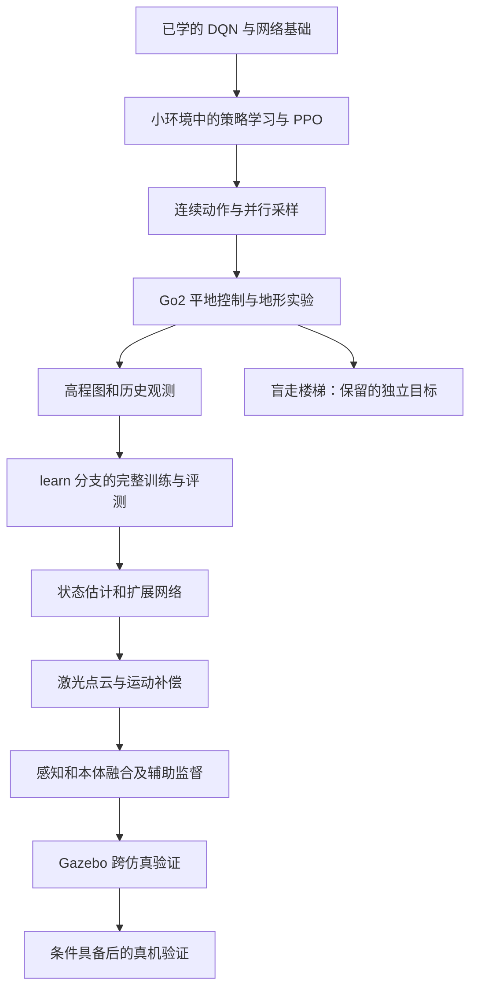

# 从 DQN 走向 PPO 与感知四足运动

> [!tip] 当前执行进度（2026-09-14）
> PPO 使用 200—210，Go2 及后续阶段使用 500—537。当前学习 [[课程/200-policy-feedback|200 从 DQN 认识 PPO]]，状态 learning；按学习者要求慢慢讲 PPO 基础；当前讲解 Actor 提高平均回报与 Critic 估准回报的不同目标，暂不安排练习，也不推进到下一课。DQN 仍暂停。


## 现在从哪里接上

2026-09-12，按学习者要求暂停 DQN，后续有机会再继续。090—093 的已有学习记录保留，094 保留未完成的实验与诊断，095—097 暂不推进。Chromium 通关、089 容量对照、CartPole 历史验收都不作为进入 PPO 的门槛。

**下次开始 200：网络怎样直接学会更常选择有利的动作。** 先沿用已经接触过的观察、奖励、网络和参数更新，在一个小环境里建立策略学习的直觉。随后逐步拼出 PPO，最后能够解释、修改和验证目标仓库的真实训练链路。

200 已开始基础讲解，尚无学习者训练结果。下表中的实作和产物均为将来要完成的内容；不提前创建几十份空课件或替学习者写完答案。

## 可选自学支线：DQN 的改进方法

[[图谱/DQN改进方法自学路线]] 供以后自行阅读：**Double DQN → n-step → Dueling → PER → C51 → QR-DQN → NoisyNet → Rainbow 组合**。每篇直接讲解直觉、手算例子、数据/梯度路径、当前源码对应与常见误解。

其中 NoisyNet 用于理解原版 Rainbow 的探索机制。本支线不占正式课号，不恢复 094 实验，也不改变下一课 200 的 PPO 起点；资料状态为 reference，不记作学习者已完成。概念阅读与实际算法修改分别记录。

## 参考版本与最终目的

本文源码链接采用相对路径，约定感知四足仓库与本教学仓库同级存放；若目录布局不同，只调整两者的相对位置，不需要写入本机盘符。仓库内命令以各自仓库根目录为工作目录，`~` 表示相应 Linux 用户主目录。

以学习者指定的 `../rl_quadruped_perceptive_locomotion` 的 **`learn` 分支**为参考，不沿用 `isaac-lab-migration` 工作区作为基准。2026-09-12 执行 `git fetch origin learn` 后，本地 `learn`、`origin/learn` 与 `FETCH_HEAD` 一致：

```text
1444899991281d6ff6943a6cf8ef0e87dcd31cd8
```

本次核查的是该提交的源码和文档，证据层级为**静态检查**。未启动目标仓库训练或仿真，未把旧文档记录的运行结果计入学习者进度。工作区额外未跟踪的 Unitree 资源不作为此提交的依据。

最终希望你能独立回答并动手验证：机器人看到了什么、动作怎样变成关节运动、一次反馈怎样更新网络、地形和历史有什么用、哪些估计器真的在训练，以及一个检查点到底证明了什么。读懂仓库是中间里程碑，定义见 [[目标/读懂并复现感知四足运动仓库]]。

学习者随后提供他人的《20260814-双周例会》作为**最终目标**：基于纯激光点云的感知闭环四足运动，包含激光建模、历史运动补偿、PointNet 与置信度筛选、HIM 与 MLP-Mixer 融合、几何辅助监督、Gazebo Sim2sim 和真机部署。报告逐页映射、缺失信息及完成条件见 [[目标/基于激光点云的感知闭环四足运动]]。因此本路线从高程图继续走向点云策略；高程图是理解空间感知与训练闭环的中间台阶。

## 八个阶段与工程支线

| 阶段 | 课程 | 学完以后能做什么 |
| --- | --- | --- |
| A：直接学习策略 | 200—206 | 亲手实现一个小型离散动作 PPO，解释一批轨迹怎样更新策略 |
| B：连续动作与并行采样 | 207—210 | 训练连续控制小任务，读懂高斯动作、批量轨迹和目标仓库的 PPO 核心 |
| C：四足运动基础 | 500—507 | 看懂 Go2 的身体状态和控制链，完成平地训练及受控地形评测 |
| D：接入地形与历史 | 508—511 | 读懂 `learn` 的高程输入、历史和特权信息，运行自己的首轮目标任务训练 |
| E：理解原仓库的训练工程 | 512—517 | 核对奖励和时序，区分潜在特征与状态估计，做消融、续训和故障诊断 |
| F：状态估计与扩展网络 | 518—524 | 逐步理解归一化、HIM 和其他网络分支，为点云融合与辅助训练做准备 |
| G：报告中的激光感知闭环 | 525—531 | 实现激光观测、PointNet、历史运动补偿、本体融合及几何监督，完成受控训练 |
| H：跨仿真与部署验证 | 532—536 | 把冻结策略接入 Gazebo，在条件具备后分阶段真机验证，完成自己的综合报告 |
| 工程支线 | 537，可选 | 训练/回放/评测管理、检查点比较与日志平台，对应报告第 9 页 |



课号表示顺序，不代表每课必须一次对话讲完。保留已有的 500 课；109—119 暂不使用，不为填满编号添加前置课程。先完成 A，再进入 B，每次只看当前单元。517 是目标仓库主训练链路的阶段终点，536 才是面向报告的综合验收。518 的归一化和 520 的 HIM 是报告路线所需基础；519、521—524 用于覆盖仓库扩展，可先理解机制，按当前实验需要决定何时做较大训练。537 不阻挡运动策略学习。

## 学习方式与先修知识

已经学过的 Python 类、张量、前向计算、反向传播、优化器、环境接口和训练评测分离，直接拿来用。遇到断点时回看对应概念，不重上一整套 DQN。

| 遇到的新基础 | 在哪里补 | 补到什么程度 |
| --- | --- | --- |
| 概率、对数和期望 | 200—202 | 能解释抽样频率、同一动作的概率以及平均收益 |
| 递推、偏差与波动 | 203 | 用同一条短轨迹算清优势，不先要求概率论证明 |
| 正态分布、概率密度 | 207 | 能区分动作均值、探索幅度和某个动作的密度 |
| 弧度、角速度、力矩、时间步 | 501 | 能沿一个关节算清目标、误差、阻尼和限幅 |
| 坐标系、旋转、重力方向 | 502、508 | 先二维旋转，再理解机身姿态和地形采样坐标 |
| 矩阵相关、特征和注意力 | 518—522 | 从几个可手算的数开始，再对应批量网络 |
| 测量误差、时间戳、刚体变换与速度积分 | 525、527 | 先一个静止障碍点，再解释机器人运动时多帧点云如何对齐 |
| 集合编码、特征融合与几何辅助目标 | 526、528—529 | 先小点集和小矩阵，再接 PointNet、MLP-Mixer、重建和对齐损失 |

每个机制按“问题和直觉 → 同一组小数据 → 数据与梯度去向 → 代码对应 → 实际结果”讲解。尤其继续讲清 `loss` 如何通过本轮计算图连到参数、`backward()` 如何写入 `.grad`、优化器如何读取它，以及下一轮使用什么参数。

完整实作允许分几次会话完成；不把改字段、补维数、接一个调用重新拆成课。新实作放在 `exercises/`，实验放在 `experiments/`。题目、输入输出、单位、允许修改范围、运行命令和成功条件必须写进练习文件。教师提供必要接口与样板，核心实现默认由学习者完成；明确要求直接修改时再代写。

## A：从动作概率到第一版 PPO

**贯穿项目：** 计划在 `exercises/ppo_from_scratch/` 自己实现一个小训练器。环境先只依赖标准库，网络使用仓库 `.venv` 中已有的 PyTorch。各课继续同一项目，不复制目标仓库算法作为练习答案。

| 课号与主题 | 先讲清的问题 | 学习者实作与完成依据 |
| --- | --- | --- |
| **200 从 DQN 认识 PPO** | PPO 是什么；与 DQN 共享什么；收益估计和动作选择概率有什么区别 | 先分段讲解基础，根据学习者解释与追问确认理解；暂不安排练习。原抽样与更新脚手架延后，不能作为当前门槛；基础清楚后再安排实作 |
| **201 一串动作怎样分配最后的反馈** | 延迟到来的奖励怎样回到之前的动作；一次奖励和整段回报有什么区别 | 将单步任务扩成短回合，自己实现轨迹收集和折扣回报，完成一次多步策略训练，检查没有跨回合串接 |
| **202 给动作找一个比较基准** | Actor 负责选择动作，Critic 估计接下来能获得的收益；优势表示结果比基准好多少 | 接入价值网络与训练目标，追踪同一批数据分别怎样更新两个网络；判断哪些目标应当断开梯度 |
| **203 怎样估计一段轨迹的优势** | GAE 把后续误差按距离组合；为什么倒着算；真实终止、时间截断和采样窗口结束有何区别 | 实现优势与价值目标构造，用短轨迹核对数值，再用于训练；自动重置时使用正确的末状态，不把新回合观察当作旧回合结尾 |
| **204 为什么要限制一次策略变化** | 对同一个已采样动作比较新旧概率；正、负优势下裁剪分别起什么作用 | 实现 PPO 裁剪目标，固定旧概率与优势后完成批量更新；检查四种方向的例子，理解裁剪不是对网络权重或所有概率比施加硬限制 |
| **205 第一版完整 PPO 训练与回放** | 采样、构造目标、有限次重复更新、清空本轮轨迹怎样形成闭环 | 自己连好训练、保存、加载和回放入口；得到有非零参数更新的短训练产物，说明当前会了什么、还不会什么 |
| **206 PPO 训练结果复盘与一次改进** | 回报、价值误差、探索程度和新旧策略差异分别反映什么；为什么不能只看一个 loss | 完成冻结模型评测，并在证据支持下只改一个因素；理解熵、KL 和更新轮数的作用，保留没有改善的结果 |

**阶段完成依据：** 能沿真实采样记录讲清一次 PPO 更新，并亲手完成小环境训练与独立评测。PPO 可以处理离散或连续动作，因此先用少量动作讲清更新，再增加连续控制复杂度。[PPO 官方讲解](https://spinningup.openai.com/en/latest/algorithms/ppo.html)

## B：从少量动作到连续控制

继续同一个小训练器，先做一维速度跟踪，再处理多个环境。标准任务只用于需要时校验，不把 CartPole 旧 DQN 成绩当作先修要求。

| 课号与主题 | 先讲清的问题 | 学习者实作与完成依据 |
| --- | --- | --- |
| **207 连续动作怎样产生和探索** | 高斯策略输出动作均值和标准差；连续动作使用概率密度；多个动作维度怎样合成 log probability | 实现连续策略分布，检查采样动作与用于计算概率的动作一致；分别记录原始采样和执行限幅，理解更换动作变换会影响概率计算 |
| **208 第一次连续控制 PPO** | 同一个 PPO 更新能否让小物体逐渐跟上目标速度 | 实现一维速度任务的连续训练与回放，比较跟踪误差、动作大小和冻结评测；可在需要时加 Gymnasium 的连续任务作独立交叉检查 |
| **209 多个环境怎样合成一轮训练** | 时间长度 T、环境数 N、观察维数 D 各是什么；同一轮数据重复使用与长期 replay 的区别 | 实现并行轨迹、各环境独立重置和小批次更新，核对 `[T,N,D]` 展平后的字段对应；准确统计交互步与优化器步数 |
| **210 用自己的 PPO 阅读目标算法** | 熟悉的每个机制在仓库里叫什么、由谁调用 | 对照 `ppo_cse/actor_critic.py`、`rollout_storage.py`、`ppo.py` 画出调用链；核对 `ratio`、价值裁剪、熵、KL 调节、梯度裁剪和超时补偿。用一组数比较自己的实现与原实现，差异先解释，不直接改原公式 |

**阶段完成依据：** 能完成连续任务训练，解释采样时保存的旧值与更新时重新计算的新值，能读懂目标算法三个核心文件。自写教学版本不需要先实现原仓库所有网络分支。

## C：先学会看懂一只机器狗

从现有 Isaac Lab 官方 Go2 任务开始，再过渡到目标仓库的自定义任务。盲走是保留的独立目标；完成一轮有结论的盲走地形实验即可继续感知路线，不要求先在所有楼梯上成功。

| 课号与主题 | 先讲清的问题 | 学习者实作与完成依据 |
| --- | --- | --- |
| **500 观察官方 Go2 策略** | 速度命令、策略输出和身体运动分别是什么；回放为什么不会继续学习 | 沿用已有课程，首次用 GUI 观察站立、前进、转向、停止；亲手操作并记录命令与实际行为，权重与任务配置配套 |
| **501 一个动作怎样推动一个关节** | 位置目标、默认角度、PD、力矩限幅和动作保持时间如何连接 | 先用单关节小模型手算，再在仿真中记录动作→关节目标→力矩→角度；核对阻尼的方向和物理步、控制步的区别 |
| **502 机器人怎样描述自己的状态** | 世界与机身坐标、重力方向、关节编码器和接触分别告诉策略什么 | 用简单旋转和可见姿态对照观察；按名称核对关节及脚，理解机器人刚体数组与接触传感器数组不能共用下标 |
| **503 Go2 平地短训练与独立回放** | 从一个小环境到有身体的策略，多了哪些接口 | 学习者配置并运行小规模 PPO、保存、加载和评测；记录速度跟踪、跌倒、身体高度和动作变化，先证明训练闭环，再评价步态 |
| **504 奖励如何塑造实际步态** | 跟踪速度、站高、少碰撞、少抖动之间怎样取舍 | 从一段真实失败提出假设，只改变一项奖励或控制因素；比较行为与分项奖励，不预设“奖励提高就一定走得更好” |
| **505 让策略面对变化的身体和地面** | 域随机化是让训练遇到不同条件；配置范围与实际启用有何区别 | 对摩擦、质量、推扰等先选一种做对照，区分创建时、重置时和定时随机化，记录训练覆盖与未见条件下的表现 |
| **506 从平地到粗糙地形与台阶** | 地形课程怎样按表现调节难度；它与速度命令课程、奖励课程有什么区别 | 实现或配置一个受控地形实验，记录升级、降级与回合边界；需先核对 Actor 是否含高程，才能称为盲走 |
| **507 地形策略评测与复盘** | 一段成功视频能说明什么，固定训练地形又会隐藏什么 | 在独立种子、台阶尺寸、接近方向和速度下评测；上、下台阶分别记录成功率、跌倒、碰撞和跟踪误差。结论不佳也保留，不无限延长训练来刷成功 |

## D：把高程图与历史接到已经理解的控制上

**贯穿项目：** 在独立学习工程中逐步构造与 `learn` 相同含义的输入，再读取和运行其正式入口。每加入一个信息来源，都说明来源、坐标、时刻、单位、缩放、顺序和缺失规则。

| 课号与主题 | 先讲清的问题 | 学习者实作与完成依据 |
| --- | --- | --- |
| **508 高程图怎样表达脚下和前方的地形** | 世界中的地面高度怎样变成机身附近一张数值表；与深度图、点云的区别 | 用小网格实现坐标采样和相对高度，再对应当前 16×11 网格；验证平地、台阶、旋转和采样顺序，不能只看输入维数正确 |
| **509 历史观察怎样补充当前这一帧** | 多帧包含什么时间信息；历史帧、PPO 轨迹、DQN replay 为什么不是一回事 | 实现历史窗口和按环境清零，画出从旧到新的数据；对应 `ObservationHistory` 与旧 `HistoryWrapper`，确认本课没有引入循环网络 |
| **510 策略和价值网络为何看到不同信息** | 非对称 Actor-Critic 让 Critic 用训练真值，Actor 用实际可用输入；潜在特征是什么 | 构造并核对策略历史、估计器历史、特权量三条支路；对照 2180、2150、10 的来源，确认真值没有直接进入 Actor |
| **511 learn 主入口第一次完整训练与回放** | `train_isaaclab_heightmap.py` 怎样把环境、历史、PPO、日志和权重连接起来 | 学习者亲手运行有明确预算的目标任务训练，逐项确认真实射线数据、参数变化、保存和加载；和零动作、官方策略分别作合适对照，说明它们的配置差异 |

**阶段完成依据：** 能在当前分支逐项定位训练输入与输出，完成自己的短训练记录。当前入口已有适配层，课程无需先重做整套迁移工程；只有实际需要的补充才在教学工程里实现。

## E：读懂主任务的因果关系与工程细节

| 课号与主题 | 先讲清的问题 | 学习者实作与完成依据 |
| --- | --- | --- |
| **512 同样的奖励名字为什么可能训练出不同结果** | 奖励时间缩放、命令更新顺序、接触下标和终止判据都会改变任务 | 用同一状态对照旧奖励与 `LegacyReward`，核对求和、负值处理及仅乘一次 dt；追踪 `LegacyManagerBasedRLEnv.step` 的调用时序，自己编写一项有因果价值的等价性检查 |
| **513 地图噪声真的进入策略了吗** | 配置有噪声不表示 Actor 读到了它；逐点噪声、持续偏移和失效造成不同问题 | 沿当前真实高程支路检查读到哪一个张量，再在独立实验入口只引入一种干扰；先检查数据确实变了，再评测稳健性，不能给现有基线虚报含噪训练 |
| **514 从历史特征到有物理含义的状态估计** | 一个 10 维向量何时才能称为速度、摩擦等估计；监督标签和 PPO 梯度分别来自哪里 | 先从历史预测一种可核对的物理量，完成训练/留出轨迹评测；再接入策略，画清辅助损失、detach、优化器及参数变化。将新实验与基线仅受 PPO 训练的 latent 区分 |
| **515 用消融判断一个模块有没有作用** | 消融是有依据地拿掉一项能力再比较；脚本名相似为何不保证单因素 | 审核 proposed、no_hist、no_estimator、no_height_sample_bias、reduced_dny_rand 的最终配置及实际调用；选择一个有效因素做重复训练/冻结评测，不能把多个参数变化归因于一个模块 |
| **516 数值异常、续训和课程进度** | 模型、Adam 状态、课程计数和地形等级各保存什么；异常恢复与真实失败有何区别 | 在小实验中实现保存恢复和受控故障处理，检查坏 rollout 被丢弃、坏环境复位、健康环境历史保留；对应当前重试与课程保存逻辑，不把重试当作成功更新 |
| **517 主训练链路阶段项目** | 从“能启动”到“能解释、复现并改进”还缺哪些证据 | 冻结一个任务版本，独立完成训练、回放、评测及一个单因素实验；用源码解释一次正常更新和一次异常路径，交付配置、命令、产物索引、结果与局限 |

**到这里应当掌握当前实际启用的主链路。** 后面的网络课程既用于读懂 `learn` 的扩展，也为报告中的 HIM、点云融合与辅助训练准备基础；不将每个历史分支的大规模训练效果都作为过关条件。

## F：逐步读懂扩展网络

| 课号与主题 | 先讲清的问题 | 学习者实作与完成依据 |
| --- | --- | --- |
| **518 归一化也是模型状态的一部分** | 数字尺度、运行均值方差、训练/推理模式会怎样影响输出 | 用一组有分布变化的数据实现并验证归一化，区分输入归一化与 BatchNorm；检查保存加载包含所需统计量，再读 `normalizer.py` 和 `common_modules.py` |
| **519 用两段经历学习可复用的特征** | Barlow Twins 希望保留两种视图的共同信息，同时减少重复特征 | 用小批次计算相关矩阵并训练一个小编码器，再对照 `BarlowTwinsLoss`；区分相关矩阵损失和额外速度监督，不从 `np3o` 名字推断完整算法归属 |
| **520 HIM 怎样学习历史中的隐含状态** | 历史编码、当前/下一观察、速度标签和原型分配怎样配合 | 用小任务实现并跟踪一轮辅助更新，再读 `HIMEstimator` 的 `forward/encode/update/sinkhorn`；核对固定切片、标签时刻和梯度，不直接取消注释就认定可用 |
| **521 卷积怎样读取高程网格** | 把空间网格展平会丢掉哪些便于网络使用的邻近关系 | 在小高程图上实现卷积特征实验，逐项检查 reshape、行列、坐标与通道；再对应 Transformer 分支中的地图卷积 |
| **522 注意力怎样选择当前有用的地形** | 用身体状态查询哪些地形位置更相关；query、key、value 分别来自哪里 | 先用少量向量算权重，再实现一次前向和反向；对应 `MultiheadAttention` 的序列、批量和特征维，记录哪些模块收到梯度 |
| **523 扩展 Actor 的完整训练与推理边界** | 构造出网络、调用到辅助损失、真正更新和完整导出是不同环节 | 任选一个扩展结构在独立小任务中接通训练，完成保存、加载和推理一致性检查；导出时包含所需历史、归一化、编码器及动作转换，说明与当前 origin 导出的差异 |
| **524 执行器网络怎样替代简化电机模型** | 从关节误差与速度预测力矩解决什么问题；与策略网络、PD 有何区别 | 使用可复现的小型仿真数据做监督拟合和留出验证，再读 `scripts/actuator_net/`；当前主入口仍是 `LegacyPDActuator`，本课结果不自动替换它 |

## G：报告中的纯激光点云感知闭环

报告第 3—6 页提供了这部分的功能结构，尚不足以确定完整源码、损失定义和传感器协议。下表是据此设计的教学与实现顺序，不声称复原了对方所有细节。这里“纯激光”指外部地形感知来源；策略仍需本体状态，报告也明确使用 HIM 和 IMU。

| 课号与主题 | 先讲清的问题 | 学习者实作与完成依据 |
| --- | --- | --- |
| **525 激光怎样看到地形** | 点云和规则高程表的差别；安装位置、外参、视场、遮挡、距离与延迟怎样影响观测 | 建立可见的仿真激光观测和小点集坐标实验；记录点的坐标系、有效掩码、时间戳与采样规则。先只改变安装位置或一个扰动因素，验证数据变化 |
| **526 用 PointNet 和置信度处理点云** | 无固定顺序的点怎样得到固定长度特征；不可靠点怎样降低影响 | 从共享小网络与对称聚合开始实现点集编码，检验打乱顺序、点数变化、缺点和离群点；再实现一个明确可解释的置信度方案。报告没有给出其精确标签与公式，不能假定已知 |
| **527 多帧激光为什么需要运动补偿** | 同一障碍在三帧里的坐标为什么不同；HIM 线速度与 IMU 角速度如何帮助对齐 | 从静止障碍、匀速平移再到旋转，亲手实现坐标补偿；比较单帧、直接叠帧与补偿叠帧。使用实际时间戳，区分帧间对齐与一帧内扫描畸变，不把仿真真值位姿偷偷作为部署输入 |
| **528 激光特征怎样与身体特征融合** | 地形告诉策略哪里能踩，身体状态告诉它现在怎样运动；MLP-Mixer 混合的维度是什么 | 先实现可解释的简单拼接基线，再接 HIM latent 与 MLP-Mixer；分别检查 token/通道布局、梯度和推理状态。用同规约比较，不预设复杂网络更好 |
| **529 用训练期几何真值帮助感知学习** | 重建局部高度和对齐几何特征怎样提供额外反馈；训练标签为何不等于部署输入 | 先完成小高度图重建，再单独加入特征对齐；明确标签、正负样本、损失系数及哪些分支断梯度。报告图中有随机 latent 采样，若采用先讲清机制，不据此补造未展示的 KL/VAE 目标 |
| **530 第一版点云闭环 PPO 训练** | 点云编码、HIM、融合、策略、PD 与新观测怎样组成闭环 | 亲手完成短训练、冻结回放及一次行为评测；输入同时记录本体与点云，但不得使用理想高程或真值位姿绕过所设计的感知路径 |
| **531 安装扰动、时序和编码的消融实验** | 报告的三条曲线各改变了什么；训练奖励与速度误差、地形通过率怎样区分 | 用同预算、独立种子分别比较基线、编码改进、时序改进，覆盖缺点/延迟/安装误差及未见地形；先分别判断每个因素，再评价组合，不复制报告曲线作为自己的成绩 |

报告示例为每帧近区 128 点、远区 16 点，当前帧加两帧历史合计 432 点；展示的补偿间隔为 20 ms、融合 latent 为 64 维、几何重建为 96 个高度输出。这些是**报告中的设计参考**，不是已核实的通用接口或当前仓库参数。开课时先确定自己的传感器、采样和输出契约，再决定是否采用这些数值。

PointNet 的集合编码与 MLP-Mixer 的混合机制分别参考原论文；从图像提出的 Mixer 如何用于本体/激光特征需要明确新的输入契约，不能照名称直接套用。[PointNet](https://arxiv.org/abs/1612.00593)，[MLP-Mixer](https://arxiv.org/abs/2105.01601)

原仓库对应论文中的高程建图、EKF 和可选 VIO 作为补充阅读，用来理解另一条感知组织方式；学习报告中的点云策略不要求先实现完整 SLAM 系统。[高程图控制论文](https://arxiv.org/html/2505.12537v2)

## H：Gazebo 跨仿真与真机部署

| 课号与主题 | 先讲清的问题 | 学习者实作与完成依据 |
| --- | --- | --- |
| **532 把冻结策略接到第二个仿真器** | Sim2sim 是在另一套仿真执行链验证同一策略；模型加载成功还缺哪些接口 | 教师准备可用的 Gazebo 环境和底层接口，学习者实现感知预处理、历史、策略推理与动作封装；从时间、坐标、关节顺序、PD、限幅与传感器频率逐项核对，先完成平地闭环 |
| **533 Gazebo 激光与运动行为验收** | 传感器渲染、消息桥、物理推进和策略输出是否属于同一条有效闭环 | 在平地、台阶、坡地完成独立评测，比较两仿真器的输入统计、跟踪误差、跌倒、延迟与通过率；用数据定位差异，不以同 seed 要求物理轨迹逐 bit 相同 |
| **534 部署运行时与故障处置** | 控制周期内有哪些耗时；传感器过期、通信中断或非有限输出时怎么办 | 完成不驱动真机的离线/仿真运行时检查，测端到端延迟和抖动，注入缺帧、断连与超时，验证限幅、停止和恢复；导出文件包含推理所需完整模型与统计量 |
| **535 有条件的真机分阶段验证** | 仿真差距怎样表现为真实接触、传感器和电机误差 | 在明确硬件、场地和授权后，从保护条件下的站立到低速平地，再到受控障碍；逐项记录位置/速度/力矩/温度限制、通信超时、跌倒处理及急停。无硬件或条件不足时保持 planned，不阻止前面仿真学习 |
| **536 自己完成一份可复现的综合报告** | 能否解释设计、消融、失败和部署边界，而非只展示视频 | 交付自己的系统数据流、训练版本、实验规约、对照结果和失败分布；分别标明训练、独立仿真、Sim2sim、真机证据，报告尚未验证的部分，不把参考报告的结果借作验收 |
| **537 训练管理平台（可选工程支线）** | 操作界面怎样对应真实训练任务和产物 | 按需做训练/回放/评测入口、模型比较、观察/动作规格检查、运行状态与 CPU/GPU/日志展示。先保证底层命令可复现，再做界面；报告中的软件著作材料不是本次必须办理的事项 |

Gazebo Classic 的插件接口和现行 Gazebo/ROS 2 的桥接方式不同，532 开始前再核查可用版本组合与激光消息类型。目标仓库中的 Gazebo URDF 标签不能单独证明已经存在报告所需的跨仿真感知闭环。[Gazebo 官方迁移说明](https://github.com/gazebosim/docs/blob/master/common/migrating_gazebo_classic_ros2_packages.md)

## learn 分支必须读准的事实

下面以 `1444899` 的已核对源码为依据，后续参考分支更新时重新核对，不能把历史文档中的“当前”当作永久事实。

| 问题 | 当前源码事实与教学含义 |
| --- | --- |
| 训练入口是什么 | [train_isaaclab_heightmap.py](../rl_quadruped_perceptive_locomotion/scripts/train_isaaclab_heightmap.py) 调用自定义环境与 `load_original_ppo()`，不等于运行最新 RSL-RL 的官方 Runner |
| 旧版本怎样保留 | `assert_legacy_baseline()` 保护 `24e94f74b1fc4a5e88e202f34357b2850f304bb3` 的原环境、算法、Go2 URDF 和 terrain_curriculum 脚本。本次 Git 对照确认这些路径在 `learn` 无差异；练习不通过删除保护检查来修改基线 |
| 实际输入维度 | 16×11=176 个高程值；策略单帧为 3 命令+3 重力方向+12 关节位置+12 关节速度+12 动作+176 高程=218。估计器单帧去掉命令为 215；默认 10 帧分别为 2180、2150。见 [legacy_task.py](../rl_quadruped_perceptive_locomotion/robodog_isaaclab/legacy_task.py) 与训练入口的维度检查 |
| Actor 与 Critic | `origin_actor` 使用策略历史与 adaptation 输出的 10 维潜在特征；Critic 使用策略历史与 10 维特权真值。特权量为摩擦、恢复系数、线速度、脚接触和高度偏置，不能把 latent 自动当作这些量的准确估计 |
| 哪些模块在学习 | [actor_critic.py](../rl_quadruped_perceptive_locomotion/robodog_gym_learn/ppo_cse/actor_critic.py) 的 origin 路径保留 adaptation 梯度；[ppo.py](../rl_quadruped_perceptive_locomotion/robodog_gym_learn/ppo_cse/ppo.py) 的独立 adaptation、HIM 和 Barlow Twins 辅助更新仍被注释。当前训练入口固定 origin，其他结构不算已启用 |
| 高程噪声是否生效 | 当前 `policy_observation()` 读取射线命中高度，经相对高度和缩放送入 Actor，没有在此支路加入高程噪声；本体观察仍有噪声。高度偏置变量出现在 Critic，不足以证明 Actor 得到了带偏移地图 |
| 动作与时间 | 12 个连续动作经位置目标转换，交给带固定 6 个物理步延迟的 PD。物理步 0.005 s，每 4 步作一次策略决策，控制周期 0.02 s；固定延迟为 0.03 s。开关名字有 randomize，不等于延迟在随机抽样 |
| 三种数量 | 默认 4096 环境×24 步=98,304 条转移；一轮包含 5 遍×4 小批次=20 次主优化器更新。入口将 max_iterations 称为 PPO 更新次数，阅读时要区分整轮与一次 optimizer.step |
| 续训恢复什么 | 当前保存网络、优化器、common_step_counter、terrain_levels、terrain_types 等；这是学习状态与课程进度恢复，不意味着物理世界和随机轨迹逐步无缝续接 |
| 数值异常怎样处理 | 无效 rollout 会丢弃；坏环境复位且不作为课程失败；PPO 异常时恢复模型与优化器再重采样。重试数、有效迭代数和环境控制计数需要分开读 |
| 哪些说明已过时 | `docs/学习资料/01…`、`02…` 的 122/1220 维和 3 维特权量属于旧适配说明；当前以执行入口、legacy_task、JSON 快照为准。历史文档“已撤回”提示也不能覆盖后来重新加入的当前源码 |
| 仿真迁移的边界 | 当前基于 Isaac Lab/Isaac Sim 实现旧任务的数值定义，使用仓库 Go2 URDF 转换资产；与 Isaac Gym 的物理轨迹和最终训练效果是否一致仍需实验，不由公式检查自动证明 |

## 源码阅读地图

路径均位于指定的目标仓库；先按对应课程读所需函数，最后再覆盖整个模块。原版、适配版、扩展版与运行辅助分开记录。

| 代码区域 | 重点追踪 | 对应课程 |
| --- | --- | --- |
| [ppo_cse/actor_critic.py](../rl_quadruped_perceptive_locomotion/robodog_gym_learn/ppo_cse/actor_critic.py) | 动作均值/标准差、log_prob、价值网络、origin 和其他 actor 分支 | 207、210、510、514、518—523 |
| [ppo_cse/rollout_storage.py](../rl_quadruped_perceptive_locomotion/robodog_gym_learn/ppo_cse/rollout_storage.py) | 旧值快照、GAE、returns、优势标准化、小批次及 clear | 203—205、209—210 |
| [ppo_cse/ppo.py](../rl_quadruped_perceptive_locomotion/robodog_gym_learn/ppo_cse/ppo.py) | 超时补偿、概率比、损失、KL 学习率与实际优化器调用 | 204—210、514、516 |
| [训练入口](../rl_quadruped_perceptive_locomotion/scripts/train_isaaclab_heightmap.py) 与 [ppo_loader.py](../rl_quadruped_perceptive_locomotion/robodog_isaaclab/ppo_loader.py) | AppLauncher、原版保护、模型与缓存创建、采样/更新、有限值保护、计时与保存 | 210、511、516—517 |
| [environment.py](../rl_quadruped_perceptive_locomotion/robodog_isaaclab/environment.py) | 调度顺序、自动复位、历史、官方/自训分支、GUI 适配 | 500—502、509—512、516 |
| [legacy_task.py](../rl_quadruped_perceptive_locomotion/robodog_isaaclab/legacy_task.py) 与 [参数快照](../rl_quadruped_perceptive_locomotion/robodog_isaaclab/legacy_24e94f7.json) | 关节和接触索引、观察、PD、奖励、终止、随机化与地形课程 | 501—513 |
| [旧环境](../rl_quadruped_perceptive_locomotion/robodog_gym/envs/base/legged_robot.py)、[旧观察](../rl_quadruped_perceptive_locomotion/robodog_gym/envs/base/observations.py)、[旧历史](../rl_quadruped_perceptive_locomotion/robodog_gym/envs/wrappers/history_wrapper.py) | 原任务数据从哪里来，适配时哪些语义必须保留 | 501—512、517 |
| [旧奖励](../rl_quadruped_perceptive_locomotion/robodog_gym/envs/rewards/corl_rewards.py)、[旧地形](../rl_quadruped_perceptive_locomotion/robodog_gym/utils/terrain.py)、[旧命令课程](../rl_quadruped_perceptive_locomotion/robodog_gym/envs/base/curriculum.py) | 从原始量到奖励，地形生成与课程采样 | 504—508、512、515 |
| [terrain_curriculum 入口](../rl_quadruped_perceptive_locomotion/scripts/train_exteroceptive_terrain_curriculum.py) 与 [proposed 入口](../rl_quadruped_perceptive_locomotion/scripts/train_exteroceptive_robust_icra_proposed.py) | 默认配置→机器人配置→脚本覆盖；再比较同目录消融脚本 | 506、511—515 |
| [HIM](../rl_quadruped_perceptive_locomotion/robodog_gym_learn/ppo_cse/him_estimator.py)、[归一化](../rl_quadruped_perceptive_locomotion/robodog_gym_learn/ppo_cse/normalizer.py)、[公共网络](../rl_quadruped_perceptive_locomotion/robodog_gym_learn/ppo_cse/common_modules.py) | 辅助网络的输入、目标、状态与梯度 | 518—523 |
| [旧 Runner](../rl_quadruped_perceptive_locomotion/robodog_gym_learn/ppo_cse/__init__.py)、[另一套 PPO](../rl_quadruped_perceptive_locomotion/robodog_gym_learn/ppo/ppo.py) 与其同目录模块 | 区分历史实现和当前真正使用的类；日志、导出及接口差异 | 210、517、523 |
| [自动评测](../rl_quadruped_perceptive_locomotion/scripts/evaluate_isaaclab_heightmap.py)、[公式核对](../rl_quadruped_perceptive_locomotion/scripts/verify_isaaclab_legacy.py)、[teleop](../rl_quadruped_perceptive_locomotion/robodog_isaaclab/teleop.py)、[官方策略](../rl_quadruped_perceptive_locomotion/robodog_isaaclab/official_policy.py) | 训练与评测配置、人工速度命令、基线比较、原生运行证据 | 500、503、507、511、516—517 |
| [执行器训练](../rl_quadruped_perceptive_locomotion/scripts/actuator_net/train.py) 与其 eval/utils、机器人 URDF/配置 | 数据来源、机械参数和模型边界；不能照搬其他机器人的关节下标 | 501—502、524 |
| [启动脚本](../rl_quadruped_perceptive_locomotion/scripts/isaaclab.sh)、[Docker 说明](../rl_quadruped_perceptive_locomotion/docker/isaaclab/README.md)、导出/下载与指标工具 | 环境归属、版本、日志、检查点格式及各工具服务哪条路径 | 500、511、516、523、534 |

## 运行环境与预算

这里只规划，不安装、不升级、不启动训练。到对应实作前，教师检查真实运行路径并把可执行命令写进练习，学习者不用猜环境或处理底层接口修复。

| 用途 | 采用方式 |
| --- | --- |
| 自写 PPO 和最小机制实验 | 本教学仓库 `.venv/bin/python`；新增依赖先登记 `pyproject.toml`，不装入系统环境 |
| 官方 Go2 学习 | 优先复用本仓库约定的 `isaac-lab3` 和 `~/distrobox-homes/bin/isaac-lab`；采用前核查实际版本、任务 ID 与 GUI |
| 目标 learn 入口 | 其 `scripts/isaaclab.sh` 明确进入无 3 后缀的 `isaac-lab`，与上述入口不同。到 511 前先查现有环境与依赖，再确定如何复用；不能混用两套启动器或顺便重装环境 |
| Docker 冒烟记录 | `docker/isaaclab/` 针对官方 Go1 短训练，不能代替自定义高程任务、GUI 或相机验收。旧记录仅作运行线索，本次未复跑 |

当前 Isaac Lab 官方文档提供观察历史配置与按环境重置机制，但原仓库自定义历史的初始化、展平顺序及接口需要逐项对照；不能仅因维度相同就换用现行接口。官方文档的 main 版本也不等于本机安装版本。[观察管理器文档](https://isaac-sim.github.io/IsaacLab/main/source/api/lab/isaaclab.managers.html)

首次预算建议如下，均为计划值，开课时结合真实吞吐冻结：

| 实作 | 初始规模 | 要验证什么 |
| --- | --- | --- |
| 205 小环境 PPO | CPU、1 环境、每轮 128 步、最多 40 轮 | 采样与多轮真实更新、保存加载；策略效果另作评测 |
| 208 连续小任务 | CPU、1 环境、每轮 256 步、最多 40 轮 | 连续动作概率与执行路径、学习曲线及冻结行为 |
| Go2 / learn 首次冒烟 | GUI 先观察 1 只；训练候选 16 或 32 环境、每轮 24 步、3—5 轮 | 环境推进、正确输入、有限损失、参数变化和可加载权重 |
| 行为学习与受控对照 | 冒烟后按吞吐和显存另定训练预算，提前说明环境数、轮数、预计耗时和产物 | 追求可测量的策略行为；不能把 3—5 轮冒烟作为整个机器人阶段的终点 |

首次独立评测可从每种策略 20 个回合或规定长度的测试段开始；有初步结论后用多个训练种子复核，候选为 3 个。预算变化写明原因。训练种子、选模型的验证集、最终评测种子分开；不以一次差结果迫使学习者无限刷训练。

## 论文按问题穿插阅读

沿用 `learn` 已有的 [七篇论文索引](../rl_quadruped_perceptive_locomotion/docs/学习资料/00-学习索引.md)。不先要求通读论文；先理解一个小例子，再读对应图、公式或算法段。

| 材料 | 什么时候看 | 本轮只寻找什么 |
| --- | --- | --- |
| PPO，1707.06347v2 | 204—206 | 裁剪目标、Algorithm 1 与自己训练器的对应 |
| GAE，1506.02438v6 | 203，随后 210 回看 | 短轨迹递推与估计误差的取舍 |
| Learning to Walk in Minutes，2109.11978v3 | 209、503、506 | 并行采样、训练规模和课程 |
| Walk These Ways，2212.03238v1 | 505—507 | 指令条件与行为变化；只对应本任务实际启用部分 |
| 感知四足论文，2505.12537v2 | 508—517；点云阶段按需补充阅读 | 地形输入、状态估计、消融及传感器系统边界 |
| HIM，2312.11460v3 | 520 | 原型和辅助估计的输入、目标与更新 |
| Barlow Twins，2103.03230v3 | 519 | 相关矩阵的两部分损失 |

## 怎样记录“慢慢学会”

每个阶段分别记录：**原理理解、学习者实现、真实运行、行为效果**。教师检查通过不能替代学习者实作；loss 有值不能替代参数变化；短训练不能替代独立评测。纯原理澄清可以通过解释和追问完成，真正需要动手的课程在拿到代码或运行证据之前保持 learning。

每次结束更新课程记录、[[学习主页]]、[[教学计划]] 与相关中文概念节点。后续说“继续”就沿这条路线的当前完整任务推进；不自动回到暂停的 DQN，也不因为路线列得长而一次讲完多个层级。
