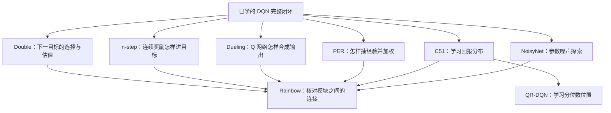

# DQN 改进方法自学路线

## 这组资料怎样使用

本组笔记直接讲解 DQN 常见改进的原理、手算例子和代码连接，属于**可选自学支线**。每篇都可以独立阅读，遇到基础概念时再沿链接回看。

PPO 主线仍从 [[PPO及感知四足课程路线|200]] 开始；DQN 的 094 实验继续保持暂停。这些笔记不占用 200—210 及机器人阶段的正式课号，也不使用预留的 109—119，不要求先读完才能学 PPO。`reference` 表示资料已备好，不代表学习者已经掌握。

每次只选一篇，从问题、数字例子到数据与梯度路径慢慢读。能用自己的话解释本篇与普通 DQN 的差别，再按需要读下一篇。不强制提交答案或开训练；以后想实作时，再建立有核心 TODO 的练习或受控实验。

## Rainbow 之后的可选阅读

[[概念/Rainbow与DQN改进组合#Rainbow 之后的代表性方向|BTR、BBF 与 Agent57]] 已记录各自解决的问题、与 Rainbow 的关系及原论文链接：BTR 关注 Rainbow 后续整合与桌面训练效率，BBF 关注有限交互数据的利用，Agent57 关注困难探索。它们不是同一条版本升级链，保持 reference，不作为 PPO 前置要求，不恢复 DQN 实验。

## 从已学内容接上

先能沿 [[概念/DQN完整训练流程与公式]] 解释：环境产生经验、回放抽样、在线网络预测实际动作、目标网络提供参照、loss 反传、优化器更新、定期同步目标。如果只忘了某一环，回看 [[概念/目标网络]]、[[概念/经验回放]] 或 [[概念/DQN目标Q值]] 即可。

## 建议阅读顺序

这里的顺序服务于理解，不是游戏调参优先级，也不是必须照做的算法升级方案。

| 阅读顺序 | 概念页 | 只抓住一个核心问题 | 读到什么程度 |
| --- | --- | --- | --- |
| 1 | [[概念/DoubleDQN与价值高估]] | 选下一动作与估值为何分开？ | 能算出普通目标 7.3 与 Double 目标 2.8，指出两个动作编号各管什么 |
| 2 | [[概念/多步回报与n-stepDQN]] | 晚几步的奖励怎样直接进入较早动作的目标？ | 能算三步目标，区分自然终止、时间截断、采样暂停及 action repeat |
| 3 | [[概念/DuelingDQN与价值优势分解]] | 整体局面与动作差别怎样合成 Q？ | 能从 V、A 得到 Q，并解释减平均及两个分支的梯度 |
| 4 | [[概念/优先经验回放PER]] | 哪些经验多抽，多抽后为何还需加权？ | 能算优先级、概率和权重，说明为什么必须逐条加权再平均 |
| 5，进阶 | [[概念/回报分布与C51]] | 平均收益相同，结果分布能否不同？ | 能用三个回报位置完成一次投影，区分回报概率与动作概率 |
| 6，进阶 | [[概念/QR-DQN与分位数回归]] | 固定分位数、学习回报位置是什么意思？ | 能解释 C51 与 QR-DQN 的区别，走完两个分位数的全配对损失 |
| 7，补充 | [[概念/NoisyNet与参数噪声探索]] | 探索为什么可以从网络参数中产生？ | 能区分参数噪声、观察噪声与 ε-greedy，追踪噪声幅度怎样学习 |
| 8，串联 | [[概念/Rainbow与DQN改进组合]] | 不同位置的改进怎样接成一个训练器？ | 能区分四项简化组合、原版 Rainbow 和 QR-DQN 组合 |

前四篇比较接近已有 DQN，C51 与 QR-DQN 可以留到概率、期望和损失已经更熟悉时再读。NoisyNet 解释参数噪声怎样产生探索，并帮助理解原版 Rainbow 的组合。

## 需要一起校正的理解

1. **已有目标网络不等于已实现 Double DQN。** 还要看下一动作由谁选、由谁估值。
2. **Dueling 不能只停在 Q=V+A。** 常见实现需要减去动作优势的平均值；其 V、A 也不能直接当成 PPO 的 Critic 和优势标签。
3. **PER 不自动识别躲避成功。** 通常根据预测误差等代理量抽样，异常数据也可能获得高优先级。
4. **n-step 不等于一次动作持续 n 帧。** 多步回报、动作保持、优化器更新次数分别影响不同环节。
5. **C51 / QR-DQN 学的是回报分布。** 不是给动作输出选择概率，也不自动改变风险偏好。
6. **Rainbow-lite 不是固定标准配方。** 必须明确实际包含哪些模块及它们怎样连接。
7. **算法升级不能保证收敛。** 观察是否有决策所需信息、奖励是否对应目标、回合是否正确，仍然影响结果。超参数也要结合当前任务、计数单位与实际预算理解。

硬同步是到时完整复制参数；软更新是按系数将目标参数向在线参数移动。两者还各自需要明确执行频率及计数单位。例如“每 100 次在线更新完整复制”和“每次按 10% 混合”就是不同规则，见 [[概念/目标网络]]。

## 和当前游戏代码怎样对照

以下是 2026-09-12 本轮的静态阅读结果，不是改进算法的运行验收：

| 当前代码 | 已看到的机制 | 未来阅读改进时对应哪里 |
| --- | --- | --- |
| [agent.py](../exercises/chromium_dqn/agent.py) | 目标网络取下一 Q 的最大值；单步奖励；MSE/Huber；显式目标同步 | Double、n-step 目标、PER 的逐样本 loss、分布损失 |
| [network.py](../exercises/chromium_dqn/network.py) | 普通 MLP，每动作一个 Q | Dueling、C51、QR-DQN、NoisyNet |
| [replay.py](../exercises/chromium_dqn/replay.py) / [tensor_replay.py](../exercises/chromium_dqn/tensor_replay.py) | 单步经验、均匀无放回抽样；张量池有环形存储 | n-step 队列、PER 概率与索引、优先级更新 |
| [train.py](../exercises/chromium_dqn/train.py) | 串起采集、抽样、更新、探索、同步与保存 | 改进以后仍需闭合的整条时间线 |
| [fast_update.py](../exercises/chromium_dqn/fast_update.py) | 另有编译 SGD 更新路径，仍取目标网络最大下一 Q | 如使用此后端，也需核对算法定义，不只改一个入口 |
| [task.py](../exercises/chromium_dqn/task.py) | 按 task version 决定观察与动作，保留多个历史版本 | 观察维度和动作数量要与本次任务及检查点对应 |

本次静态核对时，`TrainConfig` 默认是 `task-v8-five-actions`：36 维观察、5 个动作、Huber 损失。以后以实际训练配置和检查点内保存的规格为准，不仅看旧注释或类的默认参数。

当前这些代码没有因为建立概念页而切换为 Double、Dueling、PER、n-step、C51 或 QR-DQN。本轮没有开始新的 DQN 训练，也没有把旧实验标为完成。

## 任务设计与算法改进的区别

速度与惯性、敌弹排序、相对坐标、动作保持、奖励来源、热身采样都值得理解，但它们不都是 DQN 算法变体：

- 观察是否足够：[[概念/单帧观察与运动信息]]、[[概念/游戏内部状态与策略接口]]。
- 动作持续时间：[[概念/动作保持与观察时间对齐]]、[[概念/DQN训练的三种计数]]。
- 奖励与真实事件：[[概念/游戏事件与奖励终止]]、[[094-training-budget|094 的历史诊断记录]]。
- 经验池与训练起点：[[概念/经验回放]]、[[概念/回放预填充与训练起点]]。
- 子弹/敌机共享编码器：先理解“同类对象共用一套处理规则，再聚合成固定特征”；它属于输入表示设计。与后续 146 的 PointNet 集合编码有相通直觉，但游戏对象特征与激光几何不是同一个输入契约，也不能据此直接减少当前动作数。

恢复实验时，若同时修改观察、动作、奖励、网络和抽样，得到的是一个整体新方案；不能将效果归因于某个单独算法。先读懂，再按真实问题选择一个因素。

## 与 PPO 主线的联系

这组资料可以帮助分清：DQN 的 replay 与 PPO 的本轮轨迹不同；Dueling 内部的 A 与 PPO 的优势估计不同；回报分布与动作分布不同；n-step 和 GAE 都使用时间上的反馈，但目标不同。

这些边界可以在 PPO 课程遇到时回来对照，不构成 PPO 的前置验收。当前正式路线与下一步见 [[PPO及感知四足课程路线]]。
