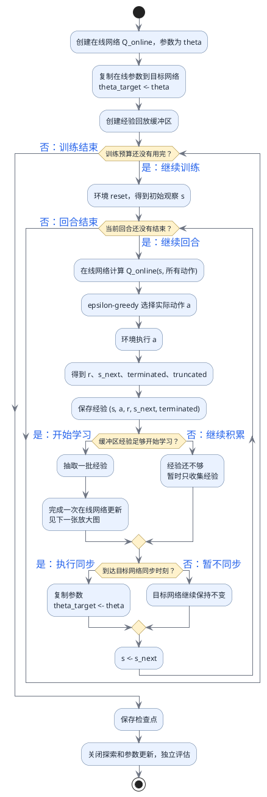
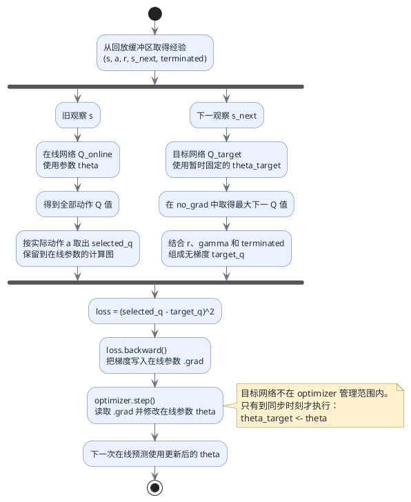

# DQN 完整训练流程与公式

## 这篇文档解决什么问题

`pytorch_one_dqn_update.py` 只实现了完整 DQN 中很小的一部分：**已经拿到一条经验后，怎样更新一次在线网络**。如果没有先看到完整系统，很容易误以为 DQN 只有 `loss.backward()` 和 `optimizer.step()`。

DQN 实际上有三件事以不同速度重复：

1. **环境交互：** 在线网络根据观察选择动作，环境产生新经验；
2. **在线学习：** 从回放缓冲区取经验，频繁更新在线网络；
3. **目标同步：** 每隔较长时间，把在线参数复制给目标网络。

> [!important] 先记住这个位置关系
> `pytorch_one_dqn_update.py` 对应第 2 项中的一次更新。它没有负责创建环境、选择探索动作、收集很多经验、控制完整 episode 或定期同步目标网络。

## 一、先认识一条经验中的量

环境执行一次动作后，产生一条经验：

$$
(s, a, r, s', terminated)
$$

先不用背符号，逐个对应：

| 符号 | 普通语言含义 | 在练习中的名字 |
| --- | --- | --- |
| $s$ | 执行动作前的旧观察 | `observation` |
| $a$ | 当时实际执行的动作编号 | `executed_action` |
| $r$ | 环境执行动作后立即给出的奖励 | `reward` |
| $s'$ | 动作执行后的下一观察 | `next_observation` |
| `terminated` | 任务状态是否真正结束 | `terminated` |
| $\gamma$ | 未来价值保留多少 | `discount_factor` |

网络参数也有两份：

| 符号 | 含义 | 更新方式 |
| --- | --- | --- |
| $\theta$ | 在线网络参数 | 每次训练由 optimizer 更新 |
| $\theta^-$ | 目标网络参数 | 暂时固定，定期从在线网络复制 |

## 二、完整 DQN 不是一条直线，而是三个循环

### 1. 环境交互循环

```text
当前观察
→ 在线网络输出每个动作的 Q 值
→ ε-greedy 决定探索还是利用
→ 环境执行动作
→ 得到奖励、下一观察和结束信号
→ 把经验存入回放缓冲区
```

这个循环负责产生训练数据。没有环境交互，就没有新的经验可学。

### 2. 在线网络学习循环

```text
从回放缓冲区抽取经验
→ 在线网络计算旧观察下实际动作的预测
→ 目标网络计算下一观察的未来估计
→ 组成 target
→ 计算 loss
→ backward 计算在线参数梯度
→ optimizer 修改在线参数
```

这个循环负责让在线网络逐渐改变。

### 3. 目标网络同步循环

```text
在线网络连续更新很多次
→ 到达同步间隔
→ 把在线参数复制给目标网络
→ 目标网络再次固定一段时间
```

这个循环负责让训练目标既能跟上学习进展，又不会每一步都跟着在线网络快速移动。

## 三、完整训练总流程图

下面是从初始化到完成训练预算的总流程。图中“回合结束”通常表示 `terminated` 或 `truncated` 为真；但是计算 target 时，只有 `terminated=True` 才去掉未来价值。



## 四、一次在线网络更新的两条支路

从回放缓冲区抽到一条经验后，数据会分成两条支路。

### 在线支路：产生需要被修正的预测

旧观察进入在线网络：

$$
\mathbf{q}=Q_{\theta}(s, \text{所有动作})
$$

$\mathbf{q}$ 是一个向量。假设有两个动作：

$$
\mathbf{q}=[Q_{\theta}(s,0), Q_{\theta}(s,1)]
$$

这条经验评价的是当时实际执行的动作 $a$，因此只取：

$$
q_{selected}=Q_{\theta}(s,a)
$$

代码中的含义是：

```text
online_network(observation)
→ 得到全部动作 Q 值
→ q_values[executed_action]
→ 得到 selected_q
```

不能用当前 `argmax()` 替代 $a$，因为经验中的反馈属于当时真正执行的动作。

### 目标支路：产生暂时固定的学习参照

下一观察进入目标网络：

$$
\mathbf{q}'=Q_{\theta^-}(s', \text{所有动作})
$$

如果任务没有真正终止，选择下一观察中最大的未来估计：

$$
q_{next}=\max_{a'}Q_{\theta^-}(s',a')
$$

然后组成 target：

$$
y=r+\gamma q_{next}
$$

如果任务真正终止，已经没有下一动作：

$$
y=r
$$

合并写成：

$$
y=
\begin{cases}
r, & terminated=True \\
r+\gamma\max_{a'}Q_{\theta^-}(s',a'), & terminated=False
\end{cases}
$$

目标支路使用 `torch.no_grad()`。这表示本次 `backward()` 不沿 target 返回目标网络参数。

## 五、一次更新的放大流程图



这张图中最重要的是：

```text
loss.backward() 只计算梯度，不修改参数
optimizer.step() 读取梯度，才真正修改在线参数
目标网络不在 optimizer 管理范围内
```

## 六、损失和参数更新公式

预测是在线网络对实际动作的当前估计：

$$
q_{selected}=Q_{\theta}(s,a)
$$

target 是奖励和目标网络未来估计构成的参照：

$$
y=r+\gamma\max_{a'}Q_{\theta^-}(s',a')
$$

平方损失衡量二者相差多远：

$$
L(\theta)=(Q_{\theta}(s,a)-y)^2
$$

注意 $L$ 写成 $L(\theta)$，是因为在线预测由在线参数 $\theta$ 计算得到。即使 `loss` 是刚刚创建的张量，它仍通过本轮计算图连接到 $\theta$。

`backward()` 计算损失相对于在线参数的梯度：

$$
\nabla_{\theta}L
$$

学习率记作 $\alpha$，optimizer 的更新可直观理解为：

$$
\theta \leftarrow \theta-\alpha\nabla_{\theta}L
$$

这一步只更新在线参数。目标参数仍然是：

$$
\theta^- \text{ 保持不变}
$$

到了同步时刻才执行：

$$
\theta^- \leftarrow \theta
$$

## 七、用当前练习的固定数字走一遍

练习中的经验：

```text
observation      = [0.2, -0.1]
executed_action  = 1
reward           = 0.2
next_observation = [0.4, 0.2]
discount_factor  = 0.9
terminated       = False
```

在线网络对旧观察预测：

```text
q_values = [0.10, -0.05]
```

实际动作是 `1`：

```text
selected_q = q_values[1] = -0.05
```

目标网络对下一观察预测：

```text
next_q_values = [0.90, -0.10]
best_next_q = 0.90
```

没有真正终止，因此：

```text
target_q = 0.2 + 0.9 × 0.90
         = 1.01
```

损失：

```text
loss = (-0.05 - 1.01)²
     = 1.1236
```

`backward()` 得到在线参数梯度，optimizer 以学习率 `0.1` 更新一次后：

```text
selected_q_after = 0.1726
```

它没有一次就等于 `1.01`，但已经从 `-0.05` 朝 target 移动。目标网络参数保持不变。

## 八、把流程对应回练习的 TODO

`exercises/pytorch_one_dqn_update.py` 不要求实现完整环境训练。它只要求你完成上面第二张图的紫色和绿色部分：

| 顺序 | 当前练习负责什么 | 背后原理 |
| --- | --- | --- |
| 1 | 清空旧梯度 | 避免上一条经验的梯度残留 |
| 2 | 在线网络预测旧观察 | 建立预测到在线参数的计算图 |
| 3 | 按实际动作索引 | 这条经验只评价当时执行的动作 |
| 4 | 计算无梯度 target | 奖励加暂时固定的未来估计 |
| 5 | 计算平方损失 | 衡量在线预测离参照多远 |
| 6 | 反向计算 | 把梯度写入在线参数 `.grad` |
| 7 | optimizer 更新 | 真正改变在线参数 |
| 8 | 返回更新前的关键张量 | 让检查器验证数据流是否正确 |

> [!warning] 当前练习不负责
> 它不负责 ε-greedy、环境 `step()`、经验回放抽样、批量张量、目标网络定期同步、完整 episode、检查点或冻结评估。不要把这些内容塞进 `one_dqn_update()`。

## 九、最短记忆主线

```text
环境产生经验
→ 回放缓冲区保存经验
→ 在线网络给出旧观察的当前预测
→ 目标网络给出下一观察的暂时固定未来估计
→ 奖励和未来估计组成 target
→ loss 比较预测和 target
→ backward 计算在线参数梯度
→ optimizer 修改在线参数
→ 多次更新后同步目标网络
→ 训练结束后关闭探索和更新，独立评估
```

## 当前边界

> [!info] 静态检查
> 本文记录标准 DQN 的概念流程、单条经验公式和当前练习中的固定数字。

> [!warning] 尚未验证
> `pytorch_one_dqn_update.py` 的学习者练习已经通过；本文流程图仍不代表已经完成批量经验更新、CartPole 冒烟训练、检查点保存或独立评估。

## 关联

- 当前练习：[[049-pytorch-one-dqn-update|把预测、target 和 optimizer 合成一次 DQN 更新]]
- 下一练习：[[050-pytorch-batch-selected-q|一批经验怎样逐行取得实际动作 Q 值]]
- 简要流程：[[概念/DQN训练流程]]
- Q 表到神经网络：[[概念/DQN与神经网络估值]]
- 两个网络：[[概念/目标网络]]
- target 公式：[[概念/DQN目标Q值]]
- 实际动作索引：[[概念/所选动作Q值与索引]]
