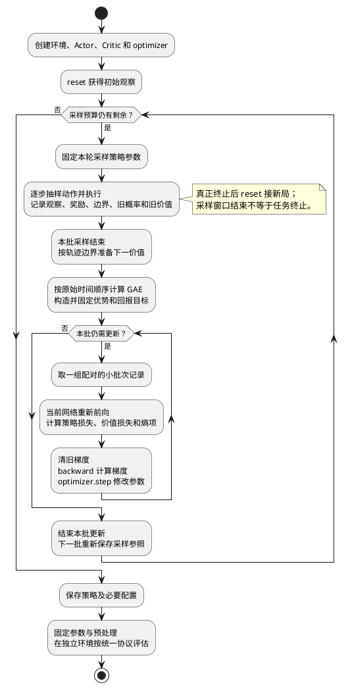
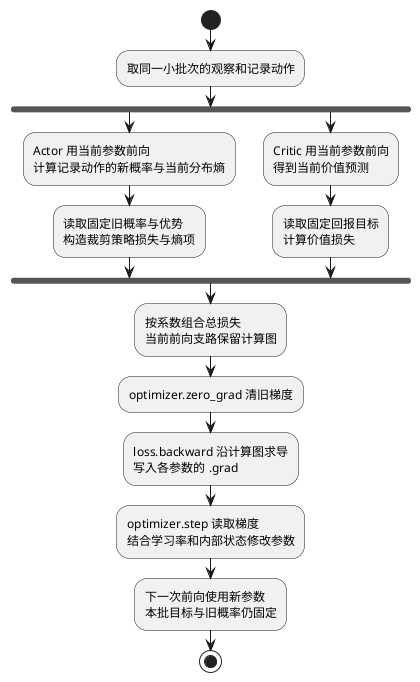

# PPO 完整训练流程与公式

## 这篇文档解决什么问题

这是一篇持续维护的 PPO 总文档：把环境交互、回报与优势、策略裁剪、价值拟合、梯度更新和独立评估放在同一条主线上。先看各部分解决的问题，再按需查公式；不要求靠手算记忆，也不把读完文档视为完成训练。

本文主线是 **PPO-Clip + GAE + 状态价值 Critic**，对应当前五格走廊练习的算法设计。PPO 不只一种目标形式，GAE 也不是只有 PPO 能用。连续动作、并行环境和额外稳定化设置在后续实际引入时扩充。

> [!info] 总览与专题的分工
> 本文保留完整、可独立阅读的流程与关键公式；[[图谱/PPO概念学习索引]] 按问题导航到专题页。后续概念、公式、代码接口和验证结果变化时，更新本文对应章节，不按聊天顺序堆补丁。

## 一、与 DQN 对照，先认清职责

| 部分 | DQN | 本文 PPO |
| --- | --- | --- |
| 怎样选择动作 | 网络估计各动作 Q，再用贪心或 ε-greedy | Actor 产生动作分布，再按分布抽样 |
| 估计什么收益 | 状态与动作的未来收益 | Critic 估计按当前策略继续的状态价值 |
| 训练资料 | 通常长期保存经验回放 | 通常收集最新一批轨迹，有限轮使用后换新批次 |
| 更新参照 | 较稳定的目标 Q 网络 | 本批固定的旧概率、旧价值、优势和回报目标 |
| 限制更新的主要关系 | 目标网络等机制稳定学习参照 | 概率比与裁剪控制策略目标的部分改进收益 |

DQN 的在线网络与目标网络都输出 Q，不能对应成 Actor 与 Critic。Actor-Critic 是两个职责，网络可以独立，也可以共享特征层；不强制两个模型文件或两个优化器。

环境负责执行动作并按奖励规则返回反馈。Critic 不发奖励，也不提供给 Actor 模仿的正确动作标签。详见 [[概念/Actor与Critic]]。

## 二、一条记录与一批数据中的量

本文统一用 $r_t$ 表示执行本步动作后收到的奖励，用 $\rho_t$ 表示概率比，避免把两个量都写成 r。

| 符号 | 含义与来源 | 当前练习字段 |
| --- | --- | --- |
| $s_t$ | 动作前观察，来自环境 | `observations[t]` |
| $a_t$ | 当时真正执行的动作 | `actions[t]` |
| $r_t$ | 执行动作后的即时奖励 | `rewards[t]` |
| $s_{t+1}$ | 执行动作后的接续观察，不是 reset 后新观察 | 环境 step 返回值 |
| $d_t$ | 真正终止为 1，否则为 0 | `terminated[t]` |
| $\log\pi_{\mathrm{old}}(a_t\mid s_t)$ | 采样动作的旧对数概率 | `old_log_probs[t]` |
| $V_{\mathrm{old}}(s_t)$ | 采样时的当前价值预测 | `old_values[t]` |
| $V_{\mathrm{old}}(s_{t+1})$ | 接续观察的未来预测 | `next_values[t]`，终止时已置零 |

用 $s$ 表示网络所见观察只是本课记号；观察不完整时，不能据此假定它包含真实状态的全部信息。

| 训练量 | 含义 |
| --- | --- |
| $\theta,\phi$ | 当前 Actor、Critic 参数 |
| $G_t$ | 从当前动作开始，后续奖励形成的折扣回报 |
| $\delta_t$ | 本步结果对旧价值预期的修正，即时序差分误差 |
| $\hat A_t$ | 本批计算出的优势估计 |
| $\hat R_t$ | 供 Critic 拟合的回报目标，一般仍含预测 |
| $\gamma$ | 每个决策步的奖励折扣 |
| $\lambda$ | GAE 对不同长度评价的组合参数 |
| $\epsilon$ | PPO 策略裁剪宽度 |
| $c_V,c_H$ | 价值损失、熵奖励的权重 |

“old”是相对当前这一批更新而言。通常保存数值就够了，不要求每批一直保留两套完整网络；换新批次时，新策略产生的新记录成为新的参照。

## 三、先看完整训练循环

PPO 中有三种不同粒度：

1. 环境逐步交互，产生连续记录。
2. 收集够一批后，按时间顺序构造固定优势和回报目标。
3. 在本批数据上做有限轮小批次更新，再回到环境收集新资料。



一个 epoch 表示将本批数据完整用于训练一次；一个 minibatch 是其中一小组配对记录。第二组前向已使用第一组更新后的参数，但本批旧概率与目标仍不变。图中内循环概括有限个 epoch 内的小批次更新；启用 KL 提前停止的实现可能提早结束它。

## 四、采样时做什么，为什么不保留训练计算图

Actor 接收观察并输出分布。离散动作练习先输出两个原始偏好分数 logits，再由分类分布转换为动作概率，抽样得到 $a_t$。Critic 同时预测当前价值。环境执行动作后，记录奖励与接续观察。

采样阶段不更新参数，保存的是旧预测与旧概率数值，通常在 `no_grad()` 下运行。这样没有把整个环境交互过程保留成一个庞大计算图。训练时会用同一观察与记录动作重新前向，建立当前参数的梯度路径。

本批一开始的概率比通常等于 1；这个数值不表示没有梯度，因为训练时的分子仍是当前 Actor 的前向计算结果。

## 五、奖励怎样成为回报与价值目标

奖励是单步反馈，回报是从某个时刻开始的后续累计。折扣处理奖励发生的远近：

$$
G_t=r_t+\gamma r_{t+1}+\gamma^2r_{t+2}+\cdots
$$

所以同一段经历中，每一步都有从自己时刻开始的回报。已经过去的奖励不算当前动作的后果。

完整回合结束后，可以全部使用实际奖励；只观察到片段时，将片段内真实奖励与末状态价值预测接起来。后者是回报估计，不能说已经真实拿到了未来奖励。PPO 不要求奖励只在终点出现，也不要求等整局结束才学习。

Critic 学习目标里的真实奖励提供纠正依据。未知未来用预测补充，不是把已经观察到的奖励与当前价值随意平均。详见 [[概念/奖励回报与折扣]]。

## 六、从单步误差到 GAE 优势

### 1. 为什么要减价值基准

价值 $V^\pi(s)$ 是按当前策略行动的通常收益；动作价值 $Q^\pi(s,a)$ 是先指定这个动作、之后按策略行动的收益。因此真实优势定义为：

$$
A^\pi(s,a)=Q^\pi(s,a)-V^\pi(s)
$$

PPO 一般不知道精确 Q 与 V，也不要求另设 Q 网络。它用实际奖励及 Critic 预测构造优势估计。正奖励仍可能低于预期；零奖励也可能通向较好的未来。

### 2. 单步误差与两种边界

为了明确区分“是否还有未来”和“是否还有后续记录”，定义两个标记：

- $b_t$：本次转移有后续任务价值时为 1，真正终止时为 0。
- $c_t$：同一条轨迹里还有下一条已记录误差可接时为 1；终止、重置或记录结束时为 0。

于是单步误差为：

$$
\delta_t=r_t+\gamma b_tV_{\mathrm{old}}(s_{t+1})-V_{\mathrm{old}}(s_t)
$$

| 记录边界 | $b_t$ | $c_t$ | 处理 |
| --- | --- | --- | --- |
| 普通中间步，后面还有同局记录 | 1 | 1 | 价值和后续误差都可用 |
| 任务真正终止 | 0 | 0 | 保留本步奖励，停止未来价值和跨回合递推 |
| 本批采样窗口结束，任务仍可继续 | 1 | 0 | 用末状态价值，但没有更多已记录误差 |
| 外部时间限制截断并重置 | 通常为 1 | 0 | 用重置前最终观察的价值，不接新回合优势 |

若时间期限本身就是任务结束条件，应按真实任务定义处理，不能一律按外部截断。五格走廊训练没有时间截断；练习已将终止处 `next_values` 置零，相当于预先处理了 $b_t$。

### 3. 为什么从后往前整理优势

GAE 将后续单步修正按距离衰减汇总，等价于组合不同长度的优势估计。下一位置开始的汇总可以直接复用：

$$
\hat A_t=\delta_t+\gamma\lambda c_t\hat A_{t+1}
$$

从本批记录外的 $\hat A_T=0$ 开始倒序计算。下一优势是误差汇总，不是下一价值；尾部优势为零，不等于末状态价值也为零。每条环境轨迹分别递推，不能跨回合或跨环境串接。

$\lambda=0$ 只使用单步误差，但仍通过下一价值考虑未来；$\lambda=1$ 使用记录内完整折扣奖励，必要时接末状态预测。增大 λ 让较长经历占更多权重，不保证训练更好。详见 [[概念/广义优势估计GAE]]。

### 4. 为 Critic 恢复回报尺度

本实现采用 GAE 对应的回报目标：

$$
\hat R_t=\hat A_t+V_{\mathrm{old}}(s_t)
$$

减去价值基准给 Actor 相对评价；加回基准给 Critic 回报尺度的目标。先构造并固定这些量，再进入网络更新。若后续引入优势标准化，必须先用原始优势生成回报目标。

## 七、Actor 的概率比与裁剪损失

### 1. 比较同一个动作的新旧倾向

更新时，将记录观察送入当前 Actor，计算记录动作的当前概率，不重新抽动作。为便于实现，记新旧对数概率之差为 $\Delta\ell_t$：

$$
\rho_t=\frac{\pi_\theta(a_t\mid s_t)}{\pi_{\mathrm{old}}(a_t\mid s_t)}
=\exp(\Delta\ell_t)
$$

旧对数概率与优势固定，当前概率对 θ 可求导。连续动作对应密度比，不能理解为某个精确实数动作的点概率。

### 2. 用优势给方向，用裁剪限制部分改进收益

未裁剪的策略目标是 $\rho_t\hat A_t$，希望它变大。正优势时增加概率有利，负优势时减少概率有利。PPO-Clip 对这项改进作保守比较：

$$
J_{\mathrm{clip}}=\operatorname{mean}_t\left[
\min\left(\rho_t\hat A_t,
\operatorname{clip}(\rho_t,1-\epsilon,1+\epsilon)\hat A_t\right)
\right]
$$

optimizer 通常最小化损失，所以用：

$$
L_\pi=-J_{\mathrm{clip}}
$$

| 优势 | 有利方向 | 哪一侧进入不再奖励继续推远的平台 |
| --- | --- | --- |
| 正 | 提高记录动作的概率 | 概率比超过上界 |
| 负 | 降低记录动作的概率 | 概率比低于下界 |

反方向越界时原目标仍有纠正信号。裁剪不是把概率或网络参数硬锁在范围里，也不保证 KL 有严格上限。其他样本、共享参数与优化器状态仍能影响输出。详见 [[概念/PPO概率比与裁剪]]。

## 八、Critic 损失、熵奖励与总损失

### 1. Critic 拟合固定回报目标

当前 Critic 前向输出 $V_\phi(s_t)$。它与固定 $\hat R_t$ 的偏差用均方误差衡量：

$$
L_V=\operatorname{mean}_t\left[(V_\phi(s_t)-\hat R_t)^2\right]
$$

这里重算当前预测，不直接训练采样时存下的旧数值。Critic 不拟合动作概率，也不把优势直接当回报。

### 2. 熵来自当前分布，鼓励保留探索

离散动作分布中，对每个动作的概率 $p_a$ 计算：

$$
H(\pi_\theta(\cdot\mid s_t))=-\sum_a p_a\log p_a
$$

零概率项按极限记为零。相同动作集合下，均匀分布熵较高，集中分布熵较低；它不是任务得分。系数为正时，优化目标可鼓励较高熵，见 [[概念/策略熵与探索]]。连续分布的熵定义与数值性质需另行说明。

### 3. 当前练习的联合损失

当前示例用独立网络支路与一个 optimizer，总损失为：

$$
L=L_\pi+c_VL_V-c_H\operatorname{mean}_t H(\pi_\theta(\cdot\mid s_t))
$$

价值误差希望变小，熵奖励希望变大，因此熵前面是负号。熵项通常不写进本批环境奖励或 GAE。这里只是当前练习约定，不要求所有 PPO 实现启用非零熵系数。

## 九、梯度怎样真正到达参数



计算图保存依赖关系：loss 依赖当前预测，预测依赖参数。因此即使 loss 刚创建，也能追溯各层参数。目标侧的数据不参与本次求导，不能靠改评价给自己加分。

backward 通常只算梯度，不改参数；optimizer 已持有参数并读取它们的 `.grad`，不需要再绑定某个 loss。独立更新前清除旧梯度，避免无意累积。

如果用最简单的无动量 SGD 表示更新方向，学习率为 α：

$$
\theta\leftarrow\theta-\alpha\nabla_\theta L,\qquad
\phi\leftarrow\phi-\alpha\nabla_\phi L
$$

当前脚手架实际使用 Adam，它还维护历史统计和缩放，不能把这个 SGD 公式当作 Adam 的完整实现。若网络共享参数，策略与价值损失可能共同更新共享部分。

## 十、哪些量固定，哪些量每小批次重算

| 量 | 本批更新期间 |
| --- | --- |
| 观察、记录动作、奖励、终止标记 | 不变，打乱时保持配对 |
| 旧概率、旧价值与末状态旧估计 | 不变 |
| 原始 GAE 优势、回报目标 | 构造后不变，不连目标侧梯度 |
| 当前概率、当前价值、当前熵 | 使用当前参数重新前向计算 |
| 概率比、损失与梯度 | 每次由当前前向结果重新计算 |
| Actor/Critic 参数 | optimizer 更新时改变 |

先按时间顺序计算 GAE，再打乱成小批次。整批重复几个 epoch，不是重做环境动作，也不能每次把刚更新的价值加到旧优势上修改目标。完成有限轮更新后，使用新策略收集下一批。

## 十一、KL 等可选机制放在哪一层

KL 比较同一观察下新旧分布差异，熵只看一套分布的随机程度。原来左 90%、右 10%，后来左 10%、右 90%，熵相同，但策略变化很大。

用来自旧策略的动作样本，一种常见近似估计为：

$$
\widehat D_{\mathrm{KL}}=
\operatorname{mean}_t\left[\exp(\Delta\ell_t)-1-\Delta\ell_t\right]
$$

在适用的支持集与采样条件下，它估计旧策略到新策略的 KL；有限样本结果不是所有状态上的精确差异。部分实现达到阈值后提前结束本批剩余更新，也有实现用它调节学习率。它通常不回滚已做更新，见 [[概念/策略差异与KL散度]]。

当前脚手架没有 KL 提前停止、优势标准化、价值裁剪或梯度裁剪。它们分别处理不同问题，后续确实引入时再补充公式与实际调用位置，不能因为已有概念就声称已实现。

## 十二、对应当前练习的三个核心 TODO

入口为 [[exercises/ppo_from_scratch/corridor_ppo.py]]，完整题意和所需接口直接写在文件内。

| 模块 | 输入 | 输出与职责 | 参数是否改变 |
| --- | --- | --- | --- |
| `collect_rollout` | 网络、可接续环境、采样步数 | 连续观察/动作/奖励/边界及旧预测 | 否，采样用 no_grad |
| `compute_gae` | 固定采样记录、γ、λ | 原始优势与 Critic 回报目标 | 否，只整理数据 |
| `update_ppo` | 本批数据、固定目标、当前网络、optimizer | 有限 epoch 更新及损失指标 | 是，学习发生在这里 |
| 教师提供的 `evaluate` | 固定策略、独立评估种子 | 成功率、得分、步数和超时数 | 否 |

观察形状 `[T,1]`；动作、奖励、旧概率、价值、优势、回报目标均为 `[T]`。动作 `int64`，终止标记 `bool`，其余记录 `float32`。同一个索引在所有字段中必须表示同一条转移。

当前任务是五格走廊：从位置 2 开始，左右移动，进入 4 得 +1，进入 0 得 −1 并结束，其他步奖励为 0。观察为 `[position / 2 - 1]`，只做数值缩放，没有提供正确动作标签。

| 当前固定设置 | 值 |
| --- | --- |
| 运行环境 | CPU、单环境，训练 seed=201 |
| 每批采样与总预算 | 128 步，40 批 |
| 每批更新 | 4 epoch，minibatch=32 |
| 优化器 | Adam，学习率 0.003 |
| γ、λ、ε | 0.95、0.95、0.2 |
| 价值与熵系数 | 0.5、0.01 |
| 评估 | 固定参数、按分布抽样，200 回合，独立 seed=1201 |

这些数值是本任务的实作起点，不是通用推荐或已证明最优的配置。当前没有要求把教师设置替代为额外调参实验。

```bash
.venv/bin/python exercises/ppo_from_scratch/corridor_ppo.py --mode inspect
.venv/bin/python exercises/ppo_from_scratch/corridor_ppo.py --mode sample
.venv/bin/python exercises/ppo_from_scratch/corridor_ppo.py --mode train
.venv/bin/python exercises/ppo_from_scratch/corridor_ppo.py --mode evaluate
```

inspect 是环境与网络接口演示；sample 检查采样，不是训练。三个 TODO 未完成会友好退出；完整训练后才保存 `artifacts/ppo_corridor/checkpoint.pt`，产物忽略提交。评估最多观察每局 64 步，未终止记超时，不在训练目标里伪装成自然失败。

## 十三、怎样判断是否真正学好了

价值损失下降，可能只是 Critic 更准确地预测失败；策略损失也不是环境得分。熵描述随机性，KL 描述变化程度，都不能替代更新后策略的实际行为。

采样日志属于产生数据的那一版策略；更新后的策略需要新的交互或独立评估。固定参数不强制动作确定：可以按分布抽样，也可以使用约定的确定性规则，但前后比较需保持协议一致。

同时检查回报、成功率、失败方式和波动。日志中未折扣的回合总分不一定等于 Critic 拟合的折扣回报；改变奖励规则后不能直接比总分。详见 [[概念/训练与评估]]。

## 当前证据与持续维护

截至本次整理，课程停留在 201、状态 learning。教师已检查五格环境、网络前向、未实现提示、冻结评估隔离及初始权重保存加载；三个核心 TODO 仍未实现，未运行 PPO 更新，没有学习者训练效果或机器人验证结论。

后续更新继续归入本篇：概念变化更新其职责与公式，接口变化更新字段和 TODO 映射，实际运行后更新预算、产物与证据边界。新增内容同时链接对应专题页；保留原有有效内容，去掉过时说明，不另建按聊天轮次重复的“完整流程”文档。

## 参考与关联

- 算法来源：[PPO 原论文](https://arxiv.org/abs/1707.06347)，[GAE 原论文](https://arxiv.org/html/1506.02438v6#S3)。
- 实现对照：[Stable-Baselines3 的 GAE 与回报目标](https://raw.githubusercontent.com/DLR-RM/stable-baselines3/master/stable_baselines3/common/buffers.py)，[策略、价值、熵损失与 KL 监控](https://raw.githubusercontent.com/DLR-RM/stable-baselines3/master/stable_baselines3/ppo/ppo.py)。这些源码只供核对，不作为学习者核心答案导入。
- DQN 对照：[[概念/DQN完整训练流程与公式]]。
- 专题入口：[[图谱/PPO概念学习索引]]。
- 当前课程：[[课程/200-policy-feedback]]、[[课程/201-feedback-across-actions]]。
- 后续路线：[[PPO及感知四足课程路线]]。
