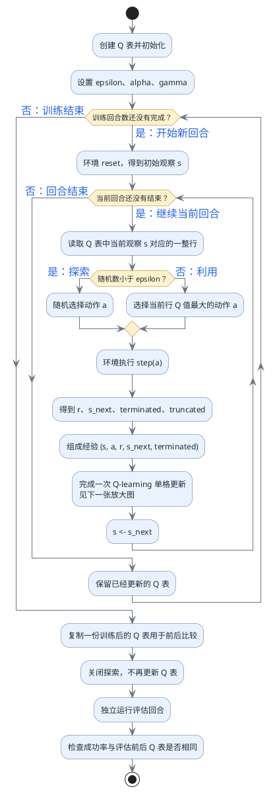
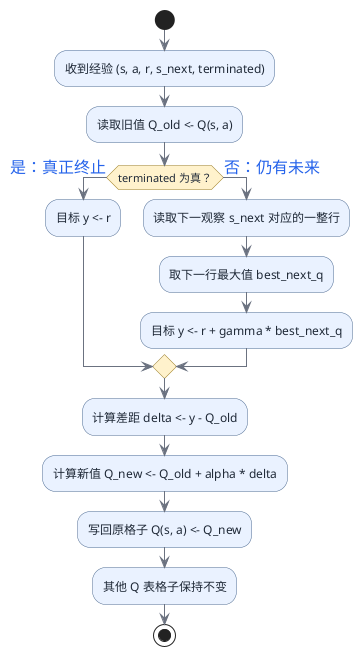

# Q 表完整训练流程与公式

## 这篇文档解决什么问题

Q-learning 不是“套一次更新公式就训练完了”。完整训练需要反复完成下面这条因果链：

```text
根据 Q 表选动作
→ 环境执行动作并返回一条经验
→ 用经验算出学习目标
→ 只更新原来那个“观察—动作”格子
→ 带着更新后的整张 Q 表进入下一步和下一回合
```

这篇文档使用同一组小数据，把**动作怎样选、数据从哪里来、公式为什么这样算、哪个格子发生变化，以及训练后怎样冻结评估**串成一个完整过程。

> [!important] 先抓住 Q-learning 的本质
> 环境不会直接告诉我们“正确的 Q 值”。它只返回奖励和下一观察。Q-learning 用“当前奖励 + 下一处已经学到的最好估计”临时组成目标，再让旧 Q 值朝这个目标移动一小步。

## 一、Q 表到底保存什么

假设环境有 3 个观察，每个观察可以选择 LEFT 或 RIGHT，Q 表可以写成：

| 当前观察 | LEFT | RIGHT |
| --- | ---: | ---: |
| 0 | 0.10 | 0.30 |
| 1 | 0.80 | 0.20 |
| 2 | 0.00 | 0.00 |

- **行**表示当前观察 $s$；
- **列**表示准备执行的动作 $a$；
- 一个格子 $Q(s,a)$ 表示：从观察 $s$ 开始先执行动作 $a$，以后继续行动，预计能获得多少累计价值。

例如 $Q(0,RIGHT)=0.30$。它不是“动作 RIGHT 的立即奖励”，也不是“到达观察 1 的编号”，而是过去经验在这个格子中形成的长期估计。

## 二、完整训练会用到哪些量

环境执行一次动作后，返回一条经验：

$$
(s,a,r,s',terminated,truncated)
$$

| 符号 | 普通语言含义 | 从哪里来 |
| --- | --- | --- |
| $s$ | 执行动作前的当前观察 | `reset()` 或上一步的 `next_observation` |
| $a$ | 这一步真正执行的动作 | ε-greedy 选出的动作 |
| $r$ | 执行动作后立即得到的奖励 | 环境 `step(a)` 返回 |
| $s'$ | 动作后的下一观察 | 环境 `step(a)` 返回 |
| `terminated` | 是否到达任务定义的真正终点 | 环境 `step(a)` 返回 |
| `truncated` | 是否因时间或外部限制被截断 | 环境 `step(a)` 返回 |
| $epsilon$ | 选择随机探索动作的概率 | 训练配置 |
| $gamma$ | 下一处价值保留多少 | 训练配置，称为折扣因子 |
| $alpha$ | 这次愿意改动旧 Q 值多少 | 训练配置，称为学习率 |

> [!note] 两种“结束”用途不同
> `terminated or truncated` 都会让当前回合停止并重新 `reset()`；但构造 Q-learning 目标时，只有 `terminated=True` 表示真的没有未来价值。仓库当前练习在 `truncated=True` 时仍保留下一观察的价值估计。

## 三、完整训练其实有两层循环

### 外层：重复很多回合

一回合结束后，环境重新 `reset()`，角色回到初始位置。但 Q 表不能清零，因为 Q 表就是跨回合积累下来的学习结果。

### 内层：完成当前回合中的每一步

每一步都要选动作、与环境交互、更新一个 Q 值，然后令 $s \leftarrow s'$，继续下一步。

## 四、Q 表完整训练总流程图

图中的“是/否”只写在条件的出口线上，动作框只描述实际执行的操作。



总流程中有三个状态需要分清：

| 对象 | 回合结束时 | 下一训练回合 | 评估时 |
| --- | --- | --- | --- |
| 环境状态 | 被结束 | `reset()` 后重新开始 | 每回合仍会 `reset()` |
| Q 表 | 保留 | 继续读取并更新 | 只读取，不更新 |
| 探索 | 下一回合仍可使用 | 按 $epsilon$ 随机尝试 | 关闭，选择当前最大 Q 值动作 |

## 五、一次 Q-learning 更新为什么这样算

现在只放大总图中的“一次单格更新”。假设刚得到经验：

```text
s = 0
a = RIGHT
r = -0.01
s_next = 1
terminated = False
```

更新前的 Q 表仍是：

| 当前观察 | LEFT | RIGHT |
| --- | ---: | ---: |
| 0 | 0.10 | **0.30** |
| 1 | **0.80** | 0.20 |
| 2 | 0.00 | 0.00 |

### 第 1 步：读出要被修正的旧 Q 值

这条经验评价的是“在观察 0 真正执行 RIGHT”的结果，所以旧值是：

$$
Q_{old}=Q(0,RIGHT)=0.30
$$

不能更新 `argmax` 出来的其他动作，因为奖励属于这一步真正执行的动作 $a$。

### 第 2 步：构造临时学习目标

问题是：环境只给了立即奖励 $-0.01$，怎样估计这一步的长期价值？

因为任务没有真正终止，可以查看下一观察 1 的整行：

$$
[Q(1,LEFT),Q(1,RIGHT)]=[0.80,0.20]
$$

Q-learning 假设未来会选择当前估计最好的动作，所以取：

$$
\max_{a'}Q(s',a')=0.80
$$

保留 90% 的未来估计，目标为：

$$
y=r+\gamma\max_{a'}Q(s',a')
$$

代入数字：

$$
y=-0.01+0.90\times0.80=0.71
$$

如果 `terminated=True`，任务已经真正结束，没有下一动作，目标只等于奖励：

$$
y=r
$$

合起来写成：

$$
y=
\begin{cases}
r, & terminated=True \\
r+\gamma\max_{a'}Q(s',a'), & terminated=False
\end{cases}
$$

这里的 $y$ 只是这次经验临时算出的参照，不会作为一个新表长期保存。

### 第 3 步：算出旧估计差了多少

$$
\delta=y-Q_{old}=0.71-0.30=0.41
$$

$\delta$ 称为 TD error，可以先把它理解为“学习目标与旧估计之间的差距”。正数表示旧值偏低，负数表示旧值偏高。

### 第 4 步：只朝目标移动一部分

若学习率 $\alpha=0.20$，这次只修正差距的 20%：

$$
\Delta Q=\alpha\delta=0.20\times0.41=0.082
$$

因此新 Q 值为：

$$
Q_{new}=Q_{old}+\alpha(y-Q_{old})
$$

$$
Q_{new}=0.30+0.082=0.382
$$

学习率没有改变目标 $0.71$，它只决定旧值这一次向目标靠近多远。

### 第 5 步：把结果写回原来的格子

Python 中必须有真正的写回：

```python
q_table[observation][action_index] = new_q
```

更新后的表为：

| 当前观察 | LEFT | RIGHT |
| --- | ---: | ---: |
| 0 | 0.10 | **0.382** |
| 1 | 0.80 | 0.20 |
| 2 | 0.00 | 0.00 |

只有 $Q(0,RIGHT)$ 改变。下一观察那一行的 $0.80$ 只是用来组成目标，这次不会被修改。

> [!warning] 只算 `new_q` 不等于学会了
> `new_q` 是一个普通的临时数字。如果没有写回 `q_table[observation][action_index]`，循环下一次仍会读到旧值 0.30，整张 Q 表不会积累任何经验。

## 六、一次单格更新的放大流程图



## 七、真正终止时为什么不能再看下一行

以 FrozenLake 到达目标格为例：

```text
旧观察 = 14
动作 = RIGHT
奖励 = 1
terminated = True
旧 Q 值 = 0
学习率 alpha = 0.2
```

到达目标后任务真正结束，不会再执行下一动作，因此：

$$
y=r=1
$$

$$
Q_{new}=0+0.2\times(1-0)=0.2
$$

这就是目标奖励第一次进入 Q 表的地方。以后更早位置通过“下一行最大 Q 值”逐步看到这份价值，于是价值可以从终点向前传播。

## 八、选动作和更新 Q 值不是同一件事

它们都会读取 Q 表，但目的不同：

| 阶段 | 读取什么 | 目的 | 是否写表 |
| --- | --- | --- | --- |
| 选动作 | 当前观察 $s$ 的整行 | 决定探索动作或当前最好动作 | 否 |
| 构造目标 | 下一观察 $s'$ 的整行 | 估计未来最好价值 | 否 |
| 学习更新 | 原格子 $Q(s,a)$ | 让旧值朝目标移动 | **是，只写这个格子** |

`a` 是这一步真正执行过的动作；$a'$ 只是为了在下一观察的各动作中寻找最大估计。两个动作符号不应混为一谈。

## 九、训练和评估必须分开

### 训练阶段

- 使用 ε-greedy，既探索也利用；
- 每一步都可以更新一个 Q 表格子；
- Q 表跨步骤、跨回合持续变化。

### 评估阶段

- 关闭随机探索，使用当前最大 Q 值动作；
- 不再执行 Q-learning 更新；
- 评估前复制 Q 表，评估后比较，必须保持完全相同；
- 成功率反映已学策略，而不是评估期间继续学习的结果。

仓库现有 FrozenLake 练习的已记录结果是：训练 1000 回合成功 525 次；随后独立冻结评估 20/20 成功，平均 6 步，路线为 `0 → 4 → 8 → 9 → 13 → 14 → 15`，且评估前后 Q 表相同。

## 十、Q 表为什么不需要 `backward()` 和 optimizer

Q 表和 DQN 解决的是同一个问题：估计“观察—动作”的长期价值。但保存和修改价值的方式不同。

| 问题 | 表格 Q-learning | DQN |
| --- | --- | --- |
| Q 值存在哪里 | 表格的独立格子 | 神经网络参数共同决定 |
| 怎样得到当前 Q 值 | 按行列直接索引 | 观察经过前向计算 |
| 一条经验怎样学习 | 用公式直接改一个格子 | 用 loss、梯度和 optimizer 改参数 |
| 是否需要计算图 | 不需要 | 需要 |
| 是否需要 `backward()` | 不需要 | 需要 |
| 是否需要目标网络 | 不需要 | 通常需要 |
| 一次更新影响范围 | 一个明确格子 | 参数变化可能影响许多观察的预测 |

表格中的每个 Q 值本身就是可直接写入的学习结果，所以公式算出 `new_q` 后直接赋值即可。DQN 没有“观察 0、动作 RIGHT”对应的独立格子，只能通过修改共享网络参数，让网络以后对这个输入给出更合适的预测。

## 十一、把完整因果链压缩成一句话

> Q-learning 用 ε-greedy 从当前 Q 表选择动作，从环境得到一条经验，用奖励和下一观察的最大 Q 值构造目标，让原来的 $Q(s,a)$ 按学习率朝目标移动，并把新值写回同一个格子；环境在回合间重置，但 Q 表跨回合保留，训练完成后冻结 Q 表再评估。

## 十二、对应代码与课程

- 一次可手算更新：[[课程/015-one-q-learning-update]]、`examples/q_learning_single_update.py`
- 完整小型训练循环：[[课程/016-full-line-world-q-learning]]、`examples/train_line_world_q_learning.py`
- FrozenLake 编程训练：[[课程/028-train-frozen-lake-q-table]]、`exercises/train_frozen_lake_q_learning.py`
- 进入 DQN 后的对应关系：[[概念/DQN完整训练流程与公式]]

## 当前证据边界

- 本文的公式和数据流与仓库现有纯 Python 实现一致；
- FrozenLake 数字来自仓库中已经记录的训练与冻结评估结果；
- 本文新增的是原理整理与流程图，没有在本次文档编辑中重新运行训练；
- 这些结果属于离散环境中的表格 Q-learning 证据，不代表 Isaac Lab 仿真训练或真机验证。
