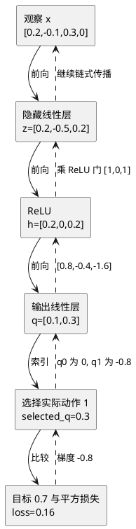

# 梯度怎样穿过输出层和 ReLU 回到隐藏层

## 本课只解决一个问题

上一课的网络能够完成：

```text
观察 → 隐藏线性层 → ReLU → 输出线性层 → 两个 Q 值
```

但网络怎样知道两层里的 23 个参数各自应当怎么改？答案不是“`backward()` 很聪明”，而是：**loss 记录着自己由哪些运算得到，反向传播按相反顺序把局部影响逐层相乘。**

本课只追踪梯度，不调用 optimizer。这样可以把“算出修改依据”和“真正修改参数”分开观察。

## 1. 仍然使用上一课同一组数字

网络结构没有改变：

```text
4 项观察 → Linear(4,3) → ReLU → Linear(3,2) → 2 个动作 Q 值
```

固定一条观察：

$$
x=[0.2,-0.1,0.3,0.0]
$$

上一课已经算出：

$$
z=[0.2,-0.5,0.2]
$$

这里 $z$ 是隐藏线性层的原始输出。经过 ReLU 后：

$$
h=ReLU(z)=[0.2,0.0,0.2]
$$

输出层得到：

$$
q=[0.1,0.3]
$$

这三个名字在本课有明确位置：

| 名字 | Python 变量 | 所在位置 |
| --- | --- | --- |
| $z$ | `hidden_pre` | ReLU 之前 |
| $h$ | `hidden_active` | ReLU 之后 |
| $q$ | `q_values` | 最终两个动作 Q 值 |

## 2. loss 到底连接了哪个输出

假设这条经验实际执行了动作 1，训练目标是 $0.7$。两个输出虽然都是网络算出来的，但这条经验直接评价的是动作 1：

$$
q_{selected}=q_1=0.3
$$

使用平方损失：

$$
L=(q_{selected}-target)^2
$$

代入数字：

$$
L=(0.3-0.7)^2=(-0.4)^2=0.16
$$

数据来源要分清：

- `0.3` 来自在线网络本轮前向计算的动作 1 输出；
- `0.7` 是训练流程在网络外构造的 target；
- `0.16` 是两者比较后刚创建的 loss；
- loss 虽然刚创建，却保存了“由 `q_values[1]` 经过减法和平方得到”的计算图关系。

动作 0 的 $q_0=0.1$ 也被前向算出，但没有参与这个 loss。因此反向时，loss 对 $q_0$ 的梯度为 0。

## 3. 第一步反向：loss 对所选 Q 值有多敏感

普通语言问题是：**如果让当前预测 $0.3$ 增加一点，loss 会怎样变化？**

平方损失的局部梯度是：

$$
\frac{\partial L}{\partial q_{selected}}
=2(q_{selected}-target)
$$

代入：

$$
\frac{\partial L}{\partial q_1}
=2(0.3-0.7)=-0.8
$$

负号表示：在当前位置稍微增大 $q_1$，loss 会下降。这与直觉一致，因为预测 `0.3` 低于目标 `0.7`。

两个输出位置合起来是：

$$
\frac{\partial L}{\partial q}=[0,-0.8]
$$

第一个 0 不是 ReLU 造成的，而是动作 0 没有被本条经验的 loss 选中。

## 4. 第二步反向：穿过输出线性层

动作 1 的输出层公式是：

$$
q_1=-1.0h_0+0.5h_1+2.0h_2+0.1
$$

如果 $h_0$ 增加一点，$q_1$ 会按权重 `-1.0` 变化；如果 $h_2$ 增加一点，$q_1$ 会按权重 `2.0` 变化。

链式法则说：

$$
\frac{\partial L}{\partial h_j}
=
\frac{\partial L}{\partial q_1}
\frac{\partial q_1}{\partial h_j}
$$

也就是用上游的 `-0.8` 乘动作 1 这一行权重：

$$
\frac{\partial L}{\partial h}
=-0.8[-1.0,0.5,2.0]
=[0.8,-0.4,-1.6]
$$

注意中间的 `-0.4` 还存在。输出层只知道它使用了 $h_1$，此时还没有穿过 ReLU。

输出层权重自身的梯度，则是“上游梯度 × 这个权重当时读到的输入”：

$$
\frac{\partial L}{\partial W_{out,1}}
=-0.8[0.2,0.0,0.2]
=[-0.16,0,-0.16]
$$

所以整个输出层权重梯度为：

$$
\frac{\partial L}{\partial W_{out}}=
\begin{bmatrix}
0&0&0\\
-0.16&0&-0.16
\end{bmatrix}
$$

- 第 0 行为 0：动作 0 没接入 loss；
- 第 1 行中间为 0：本轮 $h_1=0$，这个权重没有读到有效输入；
- 动作 1 的偏置梯度是 `-0.8`，因为偏置前面的系数恒为 1。

## 5. 第三步反向：ReLU 是一扇梯度门

前向规则是：

$$
h=ReLU(z)=\max(0,z)
$$

反向时需要问：$z$ 稍微变化，$h$ 会不会跟着变化？

$$
\frac{\partial ReLU(z)}{\partial z}=
\begin{cases}
1,&z>0\\
0,&z\le 0
\end{cases}
$$

本课固定 $z=[0.2,-0.5,0.2]$，所以三扇门是 `[1,0,1]`：

```text
z0= 0.2 > 0 → 开门
z1=-0.5 < 0 → 关门
z2= 0.2 > 0 → 开门
```

把 ReLU 后面的梯度逐项乘这三个局部导数：

$$
\frac{\partial L}{\partial z}
=[0.8,-0.4,-1.6]\odot[1,0,1]
=[0.8,0,-1.6]
$$

这里第一次清楚看到：

```text
hidden_active.grad = [ 0.8, -0.4, -1.6]
                              ↓ ReLU 关门
hidden_pre.grad    = [ 0.8,  0.0, -1.6]
```

ReLU 没有参数，也不会保存一个要被 optimizer 更新的权重。它的作用是根据本轮前向的正负状态，让上游梯度乘 1 或乘 0。

## 6. 第四步反向：回到隐藏层参数

隐藏单元 $i$ 的线性计算是：

$$
z_i=\sum_j W_{hidden,ij}x_j+b_{hidden,i}
$$

某个隐藏权重的梯度为：

$$
\frac{\partial L}{\partial W_{hidden,ij}}
=
\frac{\partial L}{\partial z_i}x_j
$$

也就是每个隐藏单元收到的梯度，乘本轮对应输入。第一行：

$$
0.8[0.2,-0.1,0.3,0.0]
=[0.16,-0.08,0.24,0]
$$

第二行收到的梯度是 0：

$$
0[0.2,-0.1,0.3,0.0]=[0,0,0,0]
$$

第三行：

$$
-1.6[0.2,-0.1,0.3,0.0]
=[-0.32,0.16,-0.48,0]
$$

合起来：

$$
\frac{\partial L}{\partial W_{hidden}}=
\begin{bmatrix}
0.16&-0.08&0.24&0\\
0&0&0&0\\
-0.32&0.16&-0.48&0
\end{bmatrix}
$$

这张矩阵里的零有不同原因：

- 第 1 行全为 0：ReLU 对隐藏单元 1 关门；
- 第 3 列全为 0：这条观察的第 3 项输入恰好为 0；
- 不能仅凭“看到 0”就断言网络出错或某参数永远不会学习，换一条观察后门和输入都可能变化。

隐藏偏置前面的输入恒为 1，所以偏置梯度就是：

$$
\frac{\partial L}{\partial b_{hidden}}=[0.8,0,-1.6]
$$

## 7. 完整因果链



顺序不能倒置：前向先创建计算图和 loss，反向才有路径可追。`backward()` 沿图写入 `.grad`，但它不会修改参数。

## 8. 为什么中间张量需要 `retain_grad()`

模型权重和偏置是需要训练的**叶子张量**，PyTorch 默认把梯度保存在它们的 `.grad` 中。

`hidden_pre` 和 `hidden_active` 是前向过程中临时算出的**非叶子张量**。PyTorch 反传时仍然会经过它们，但为节省内存，默认不会在反传结束后把它们的 `.grad` 留下来。

为了教学观察，我们在 `backward()` 前调用：

```python
hidden_pre.retain_grad()
hidden_active.retain_grad()
```

这不是让它们开始参与梯度计算；它们本来就在计算图里。它只是要求 PyTorch 在反传后保留经过这里的梯度，供我们查看。

## 9. 代码每一步对应什么机制

下面不是让你猜的 API，而是本课实现要拼起来的机制：

| Python 操作 | 对应机制 | 此时改变什么 |
| --- | --- | --- |
| `model.zero_grad(set_to_none=True)` | 清除上轮保存的参数梯度 | `.grad`，不改参数 |
| `forward_stages(observation)` | 用当前参数完成前向并创建计算图 | 新建中间张量，不改参数 |
| `retain_grad()` | 要求保留非叶子中间张量梯度 | 保存设置，不改数值 |
| `q_values[action_index]` | 只把实际动作输出接入 loss | 决定反向出口 |
| `F.mse_loss(selected_q, target)` | 比较预测与目标 | 新建带计算历史的 loss |
| `loss.backward()` | 按链式法则反向传播 | 写入 `.grad`，不改参数 |
| `optimizer.step()` | 本课不调用；以后读取参数 `.grad` | 才会真正改参数 |

这也再次回答：optimizer 不需要绑定 loss。loss 与参数的关系保存在计算图中；`backward()` 负责把结果写到参数 `.grad`；optimizer 只需要持有参数引用，随后读取这些 `.grad`。

## 本课训练

打开：

- `exercises/cartpole_relu_gradient_flow.py`

你要组装完整的前向、保留中间梯度、选择实际动作、构造 loss 和反向追踪。检查器会连续换动作，避免把动作编号或梯度写死。

运行：

```bash
.venv/bin/python -m exercises.cartpole_relu_gradient_flow
```

学习者已完成本题并由仓库环境复跑通过。

## 当前边界

> [!success] 教师参考推导
> 固定数字已经手算到两个中间张量和两层参数的梯度；检查器覆盖动作切换、ReLU 门、零输入列、旧梯度清除和参数不变性。

> [!success] 学习者训练已通过
> 学习者实现已连续通过动作 1 和动作 0 两条路径。实际输出确认前向值与 loss、两个隐藏中间梯度、两层参数梯度、旧梯度清除、动作路径切换、ReLU 截断、零输入列、非法动作拒绝和参数不变性共 9 项检查全部通过；仓库全量 112 项测试同时通过。

> [!warning] 当前边界
> 本课的 `backward()` 只产生梯度，没有 optimizer，因此网络参数没有更新；也没有完整 CartPole 训练、检查点或独立评估。学习者使用的 `model.zero_grad()` 和固定 `float32` target 在当前练习中有效；显式使用 `set_to_none=True` 与 `selected_q.dtype` 会让意图和复用边界更清楚，但不影响本课结论。

## 一句话总结

loss 沿所选动作输出反向进入输出层，再由输出权重分配到各隐藏信号；ReLU 根据本轮前向的正负状态让梯度乘 1 或 0，最后隐藏层用“收到的梯度 × 本轮输入”得到每个参数的梯度。

## 关联

- 前置：[[061-linear-limit-relu-hidden-layer|单层线性的表达边界与 ReLU 隐藏层]]
- 核心概念：[[概念/ReLU与梯度门控]]
- 自动求导：[[概念/自动求导与梯度]]
- 动作选择：[[概念/所选动作Q值与索引]]
- 后续更新：[[概念/优化器与参数更新]]
- 下一课：用 optimizer 更新两层参数后，哪几个 Q 值会一起变化
