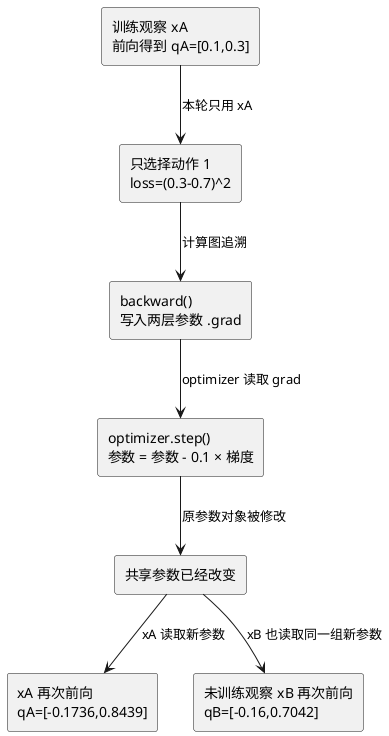

# 一次更新为什么会改变多个观察的 Q 值

## 本课只解决一个问题

第 062 课已经算出了两层参数的梯度，但没有执行 optimizer。现在只增加一步：

```text
optimizer.step()
```

真正的问题不是“这个 API 怎么调用”，而是：**只用一条观察的动作 1 误差训练，为什么动作 0 的预测和其他没有参加训练的观察也会变化？**

答案来自神经网络与 Q 表最根本的差别：神经网络不是给每个观察保存独立格子，而是让所有观察共用一套参数。

## 1. 先用一个旋钮类比共享参数

想象三个房间共用同一个总温控旋钮。你因为房间 A 太冷而调高总旋钮时：

- 你只参考了房间 A；
- 你没有单独操作房间 B、C；
- 但 B、C 的温度也可能变化，因为它们共用总旋钮。

神经网络的参数就是这种共享旋钮。训练观察决定本轮旋钮往哪里动，但参数一旦改变，下一次任何观察调用这个网络时，都会读取新参数。

这和 Q 表不同。Q 表更新 `Q(s,a)` 时，可以只改某一行某一列；神经网络更新的是一个被许多观察共同使用的计算函数。

## 2. 先分清训练材料和测量尺

代码里会出现两条观察，但只有一条是训练数据：

| 名字 | 身份 | 更新前 | 训练阶段 | 更新后 |
| --- | --- | --- | --- | --- |
| `training_observation` | 训练材料 A | 测量旧 Q 值 | 产生预测、loss、计算图和梯度 | 测量新 Q 值与新 loss |
| `comparison_observation` | 对照测量 B | 测量旧 Q 值 | **什么也不做** | 测量新 Q 值 |

`comparison` 不是 DQN 算法中的专用术语，只是本课为了观察参数影响范围而放置的“测量尺”。它不会传给训练函数，不会产生第二个 loss，也没有自己的 `backward()`。

整个程序按时间分成三段：

```text
更新前测量 A、B
→ 只用 A 执行一次训练更新
→ 更新后重新测量 A、B
```

这样才能回答本课问题：B 明明没有参与中间的训练，为什么最后也变了？

## 3. 仍用第 062 课同一条训练数据

训练观察：

$$
x_A=[0.2,-0.1,0.3,0.0]
$$

实际动作与 target：

```text
action_index = 1
target_q = 0.7
learning_rate = 0.1
```

更新前的隐藏表示和输出为：

$$
h_A=[0.2,0,0.2]
$$

$$
q_A=[0.1,0.3]
$$

只有动作 1 的 $0.3$ 接入 loss：

$$
L_{before}=(0.3-0.7)^2=0.16
$$

第 062 课已经算出这条计算图的梯度。本课不重新发明梯度，只观察 optimizer 怎样消费它们。

## 4. optimizer.step() 到底做了什么

本课使用最简单的 SGD。对 optimizer 管理的每个参数，它执行同一条规则：

$$
parameter_{new}
=parameter_{old}-learning\_rate\times gradient
$$

普通语言解释：

- `parameter_old`：本轮前向真正用过的旧参数；
- `gradient`：`backward()` 写在同一个参数对象 `.grad` 里的局部影响；
- `learning_rate=0.1`：只走梯度所建议变化量的十分之一；
- `parameter_new`：写回原参数对象的新数值。

optimizer 没有读取 observation、action、target 或 loss。它只遍历创建时收到的参数引用，并读取这些参数当前的 `.grad`。

## 5. 先手算几个参数怎样变化

动作 1 的输出偏置原来是 `0.1`，梯度是 `-0.8`：

$$
b_{out,1}^{new}=0.1-0.1\times(-0.8)=0.18
$$

负梯度被减去后，参数增大。这会帮助原本偏低的动作 1 预测上升。

动作 1 的输出权重原来是：

$$
W_{out,1}=[-1.0,0.5,2.0]
$$

梯度是：

$$
\nabla W_{out,1}=[-0.16,0,-0.16]
$$

因此：

$$
W_{out,1}^{new}
=[-1.0,0.5,2.0]-0.1[-0.16,0,-0.16]
=[-0.984,0.5,2.016]
$$

动作 0 的输出层一整行梯度为 0，所以它自己的权重和偏置保持：

$$
W_{out,0}^{new}=[1,2,-1],\qquad b_{out,0}^{new}=0.1
$$

到这里很容易误以为“动作 0 的 Q 值一定不变”。这个推论漏掉了动作 0 输出层所读取的输入 $h$ 也会变化。

## 6. 隐藏层也被同一个 loss 更新

第 062 课得到隐藏权重梯度：

$$
\nabla W_{hidden}=
\begin{bmatrix}
0.16&-0.08&0.24&0\\
0&0&0&0\\
-0.32&0.16&-0.48&0
\end{bmatrix}
$$

用学习率 `0.1` 更新后：

$$
W_{hidden}^{new}=
\begin{bmatrix}
0.984&0.008&-0.024&0\\
0&2&-1&0\\
-0.968&-0.016&1.048&0
\end{bmatrix}
$$

隐藏偏置从：

$$
b_{hidden}=[0,0,0.1]
$$

变成：

$$
b_{hidden}^{new}=[-0.08,0,0.26]
$$

隐藏单元 1 因为本轮 ReLU 关闭，没有收到梯度，所以中间一行和对应偏置保持不变。隐藏单元 0、2 的参数发生了变化。

## 7. 用新参数重新预测训练观察

同一条 $x_A$ 再次前向时，不会复用旧的 $h_A$，而是用新隐藏参数重新计算：

$$
z_A^{new}=[0.1088,-0.5,0.3824]
$$

$$
h_A^{new}=ReLU(z_A^{new})=[0.1088,0,0.3824]
$$

然后两个输出都读取这个新隐藏表示：

$$
q_{A,0}^{new}
=1(0.1088)+2(0)-1(0.3824)+0.1
=-0.1736
$$

动作 0 的输出层参数一个都没变，但它读到的隐藏输入从 `[0.2,0,0.2]` 变成 `[0.1088,0,0.3824]`，所以 Q 值仍从 `0.1` 变成 `-0.1736`。

动作 1 同时读取新隐藏表示和自己的新输出参数：

$$
q_{A,1}^{new}
=-0.984(0.1088)+0.5(0)+2.016(0.3824)+0.18
=0.8438592
$$

它越过了 target `0.7`，但距离从 `0.4` 缩小到约 `0.1439`：

$$
L_{after}=(0.8438592-0.7)^2\approx0.02069547
$$

一次 SGD 不是把预测直接改成 target。所有收到梯度的参数同时走一步，它们的组合效果可能越过 target；只要本轮之后距离更近，loss 仍会下降。

## 8. 没参加训练的观察为什么也变了

再准备一条只用于前后对照的观察：

$$
x_B=[0,0,0,0]
$$

它没有进入 loss，也没有自己的 `backward()`。更新前：

$$
h_B=[0,0,0.1],\qquad q_B=[0,0.3]
$$

参数更新后重新前向。即使输入全为 0，隐藏偏置已经变化：

$$
z_B^{new}=[-0.08,0,0.26]
$$

$$
h_B^{new}=[0,0,0.26]
$$

最终：

$$
q_B^{new}=[-0.16,0.70416]
$$

这条观察变化的完整原因是：

```text
x_A 产生 loss
→ backward 写入共享参数的 grad
→ optimizer 修改共享参数
→ x_B 下一次前向读取这些新参数
→ x_B 的隐藏表示和 Q 值变化
```

不是 `x_A` 的梯度直接流进了 `x_B`。`x_B` 根本不在本轮计算图里；两者是在不同时间通过同一组参数发生联系。

## 9. 完整因果链



图中的分叉发生在更新之后：任何后续观察都使用同一套新参数。

## 10. 这既是能力，也是风险

共享参数的好处是：网络可以把一条观察学到的规律影响到相似观察，不需要像巨大 Q 表那样只修改一个孤立格子。

但“其他预测会变化”不自动等于“其他预测一定变好”。一条样本推动参数后：

- 当前训练 loss 可能下降；
- 相似观察可能得到有用的联动；
- 其他观察也可能被推向不合适的方向。

这正是前面已经学习经验回放和批量更新的原因之一：让多条经验共同决定一次参数方向，避免网络只追随最近一条样本。但本课只观察共享参数联动，不增加新的回放机制。

## 11. 代码每一步对应什么机制

| Python 操作 | 读取什么 | 留下什么 |
| --- | --- | --- |
| `torch.optim.SGD(model.parameters(), lr=0.1)` | 模型参数对象 | 持有参数引用，不持有 loss |
| `optimizer.zero_grad(set_to_none=True)` | 上轮 `.grad` | 清空梯度，参数值不变 |
| `model(training_observation)` | 旧参数和训练观察 A | 两个动作的预测和计算图 |
| `F.mse_loss(selected_q, target)` | 动作 1 预测和 target | 与参数相连的 loss |
| `loss.backward()` | loss 的计算图 | 参数 `.grad` |
| `optimizer.step()` | 参数引用、`.grad`、学习率 | 原参数对象中的新数值 |
| 再次 `model(...)` | 新参数和任意观察 | 新预测，不会自动复用旧预测 |

如果想保存更新前参数，必须使用：

```python
before = parameter.detach().clone()
```

若只写：

```python
before = parameter
```

`before` 和模型仍指向同一个参数对象；step 修改原对象后，你看到的“before”也会显示新值，无法进行前后对照。

## 本课训练

打开：

- `exercises/cartpole_shared_parameter_update.py`

这次代码已经整理好并写入完整答案，不需要再填写二十个字段。你只需要运行它，按输出观察三个阶段：

1. 更新前测量 A 和 B；
2. 只有 A 进入 `loss → backward → optimizer.step`；
3. 更新后用同一个模型重新测量 A 和 B。

真正的训练函数 `train_on_one_observation()` 只保留六段清楚的机制：清梯度、A 前向、选择实际动作、计算 loss、反向写梯度、optimizer 改参数。B 的测量和参数检查全部在函数外，防止把“训练算法”和“教学观察工具”混为一谈。

运行：

```bash
.venv/bin/python -m exercises.cartpole_shared_parameter_update
```

学习者已经运行完整答案并确认通过。

## 当前边界

> [!success] 教师参考推导
> 固定数字已验证一次 SGD 的两层参数更新、训练观察重新预测、未选动作间接变化和对照观察联动；参考路径中训练 loss 从约 `0.16` 降到 `0.02070`。

> [!success] 学习者运行结果
> 学习者已运行并确认通过。输出显示训练观察 A 的 Q 值从 `[0.1000,0.3000]` 变为 `[-0.1736,0.8439]`，对照观察 B 从 `[0.0000,0.3000]` 变为 `[-0.1600,0.7042]`，A 的 loss 从约 `0.16` 降为 `0.02069547`。

> [!warning] 尚未验证
> 本题使用人为 target 和单条固定观察，不是完整 DQN target、回放批量、CartPole 完整训练或独立评估。

## 一句话总结

一条训练经验通过 loss 和梯度决定本轮怎样修改共享参数；optimizer 修改参数后，所有后续观察和动作输出都会读取同一套新参数，因此没有直接梯度的输出和没有参加训练的观察也可能改变。

## 关联

- 前置：[[062-gradient-through-output-and-relu|梯度怎样穿过输出层和 ReLU 回到隐藏层]]
- 核心概念：[[概念/共享参数与预测联动]]
- optimizer：[[概念/优化器与参数更新]]
- 梯度门：[[概念/ReLU与梯度门控]]
- 参数基础：[[概念/神经网络参数与预测]]
- 下一课：把真实 CartPole 回放批量送进这一个 ReLU 网络更新
