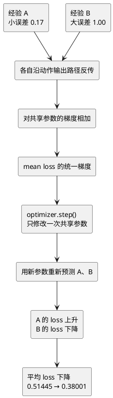

# 平均 loss 下降为什么单条经验可能变差

## 本课只解释一个现象

第 063 课已经确认：不同观察和动作共用同一套网络参数。因此，用经验 A 更新参数时，经验 B 的预测也可能变化。

现在把 A、B 同时放进一个批量。直觉上容易产生一个误解：

> 既然两条经验都参加训练，那么更新以后，两条经验的 loss 都应该下降。

这并不成立。一次批量更新直接优化的是**平均 loss**，而不是分别保证每一条经验都改善。

本课是对已有训练现象的纯原理澄清，不增加 PyTorch 接口，也不创建编程练习。

## 1. 两条经验分别提出什么要求

继续使用前几课的 4 输入、3 个 ReLU 隐藏单元、2 个动作 Q 值网络。

经验 A：

```text
旧观察 A = [0.2, -0.1, 0.3, 0.0]
实际动作 = 1
当前预测 = 0.30
target    = 0.47
```

A 的要求是：动作 1 的预测应从 `0.30` 增大，靠近 `0.47`。

经验 B：

```text
旧观察 B = [0.0, 0.0, 0.0, 0.0]
实际动作 = 0
当前预测 = 0.00
target    = 1.00
```

B 的要求是：动作 0 的预测应从 `0.00` 大幅增大，靠近 `1.00`。

两条经验的 target 来源仍遵循 DQN 规则：

- A 没有终止，`target = reward 0.20 + 0.9 × 下一观察最大 Q 0.30 = 0.47`；
- B 已终止，没有未来价值，`target = reward = 1.00`。

## 2. 更新前先分别算损失

A 的平方损失：

$$
L_A=(0.30-0.47)^2=(-0.17)^2=0.0289
$$

B 的平方损失：

$$
L_B=(0.00-1.00)^2=(-1.00)^2=1.0000
$$

这一批直接交给 `backward()` 的标量是两者平均值：

$$
L_{mean}=\frac{L_A+L_B}{2}
=\frac{0.0289+1.0000}{2}
=0.51445
$$

这里的 `mean()` 没有删除任何经验。计算图仍有两条支路，只是把两条支路的梯度都除以批量大小 `2`，再写入同一组参数的 `.grad`。

## 3. 两条经验的“意见大小”不同

平均平方损失对两个所选 Q 值的梯度分别是：

$$
\frac{\partial L_{mean}}{\partial q_A}
=\frac{2(q_A-target_A)}{2}
=0.30-0.47
=-0.17
$$

$$
\frac{\partial L_{mean}}{\partial q_B}
=\frac{2(q_B-target_B)}{2}
=0.00-1.00
=-1.00
$$

两个负号都表示“各自的所选 Q 值需要增大”，但 B 的起始误差更大，所以它传回的梯度影响也更强。

注意：这还只是 Q 值出口处的方向。梯度继续穿过各自动作的输出权重后，才会落到两条经验共用的隐藏参数上；在共享参数那里，两条意见可能发生冲突。

## 4. 冲突具体发生在什么地方

只观察第 3 个隐藏单元的偏置 `hidden_bias[2]`。更新前它是：

```text
hidden_bias[2] = 0.10
```

A 实际选择动作 1。动作 1 连接这个隐藏单元的输出权重为 `+2`，所以 A 对该偏置贡献的梯度是：

$$
-0.17\times 2=-0.34
$$

这个 `-0.34` 希望 SGD 增大隐藏偏置，从而帮助 A 的动作 1 预测上升。

B 实际选择动作 0。动作 0 连接同一个隐藏单元的输出权重为 `-1`，所以 B 的贡献是：

$$
-1.00\times(-1)=+1.00
$$

这个 `+1.00` 希望 SGD 减小隐藏偏置，从而帮助 B 的动作 0 预测上升。

两条路径在同一个参数 `.grad` 中相加：

$$
gradient_{hidden\_bias[2]}
=-0.34+1.00
=+0.66
$$

学习率为 `0.1`，SGD 更新为：

$$
hidden\_bias[2]_{new}
=0.10-0.1\times0.66
=0.034
$$

所以关键不是“两条经验是否都想让自己的 Q 值增大”，而是：它们通过不同动作权重到达共享参数后，对同一个参数提出了相反要求。本轮 B 的影响更强，合并结果让这个隐藏偏置减小。

## 5. 为什么 A 的输出反而下降

A 更新前第 3 个隐藏值是 `0.20`。共享参数更新后，它降为约 `0.1388`。

A 的动作 1 输出层参数自身确实朝正确方向移动了；如果隐藏表示完全不变，这部分会帮助动作 1 的 Q 值上升。但是输出层读取的隐藏表示也同时变了，而且共享隐藏层造成的反向影响更大。

最终结果是：

| 经验 | 所选 Q 更新前 | 所选 Q 更新后 | target | loss 更新前 | loss 更新后 |
| --- | ---: | ---: | ---: | ---: | ---: |
| A | 0.3000 | 0.2150 | 0.4700 | 0.0289 | 0.0650 |
| B | 0.0000 | 0.1663 | 1.0000 | 1.0000 | 0.6950 |

A 离自己的 target 更远了，但 B 改善得更多。平均损失因此仍然下降：

$$
L_{mean,new}
=\frac{0.0650+0.6950}{2}
\approx0.3800
$$

```text
平均 loss：0.51445 → 0.38001
```

这同时成立：

- A 本轮变差；
- B 本轮变好；
- 整批平均结果变好。

## 6. 完整因果链



`optimizer` 没有选择牺牲 A 或偏爱 B。它只读取所有参数最终累积得到的 `.grad`，沿减小本批平均 loss 的方向走一步。

## 7. 哪些结论可以得出，哪些不可以

可以得出：

- 平均 loss 是整批训练目标；
- 每条经验都通过自己的计算图贡献梯度；
- 共享参数会让这些梯度互相帮助或互相冲突；
- 平均 loss 下降不保证每条经验的 loss 同时下降。

不能得出：

- “A 变差说明 backward 算错了”；
- “B 的 loss 更大，所以应该永远只训练 B”；
- “一次平均 loss 下降就说明策略整体变好”；
- “每一步训练都必须让平均 loss 下降”。学习率过大或网络的非线性变化也可能让更新后的平均 loss 上升。

## 8. 这对真正 DQN 训练意味着什么

真实回放批量会不断更换样本。一条经验本轮可能改善，下轮又因其他经验的共享参数更新而暂时变差。因此训练时通常观察一段时间内的批量 loss 和最终环境表现，而不是要求每条历史经验的 loss 单调下降。

经验回放的作用也不是消除所有冲突，而是让一次更新同时听取来自不同时间的多条经验，避免只跟随最新一条连续经验。

## 本课学习方式

本课是纯原理澄清，不创建代码练习，也不把固定数字检查器包装成“训练”。理解重点只有一句：

> `backward()` 汇总整批样本对共享参数的梯度，optimizer 优化平均目标，因此整体改善和单条暂时变差可以同时发生。

> [!success] 学习进度
> 学习者在完成原理讲解后选择继续，当前概念记为已理解。

## 当前边界

> [!info]
> 本课数字来自受控的两条 CartPole 形状经验，用来解释梯度冲突。它没有运行完整 CartPole 环境、多轮训练、冻结评估、Isaac Lab 或真机。

## 关联

- 前置：[[063-one-update-affects-many-predictions|一次更新为什么会改变多个观察的 Q 值]]
- 批量平均：[[概念/批量损失与梯度平均]]
- 共享影响：[[概念/共享参数与预测联动]]
- 梯度：[[概念/自动求导与梯度]]
